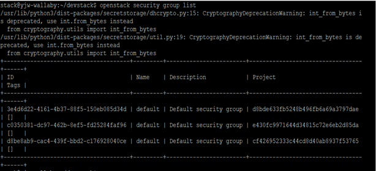
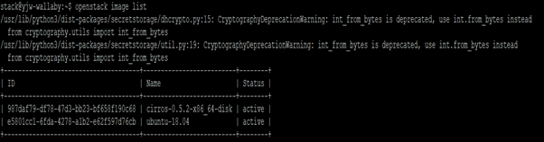

2week - CLI와 친해지기
======================================================================

1) cirros image로 인스턴스 생성을 cli로 해보기
**************************************************************************************

우선 devstack에서 Cli 환경에서 사용하려면 환경설정을 해야 합니다.

devstack에서는 환경변수를 계정에 맞게 설정해주는 스크립트를 제공합니다.

$ cd /opt/stack/devstack

$ source openrc admin admin

.. image:: images/picture_1.png

다음의 에러 메시지는 향후에 OS_TENANT_NAME 변수가 없어질 수 있음을 알려주는 것입니다.
무시하셔도 됩니다.

WARNING: setting legacy OS_TENANT_NAME to support cli tools

**Openstack image list 명령어를 입력하여 현재 사용할 수 있는 image를 확인합니다.**

Cirros-0.5.2-x86_64-disk 이미지를 사용할 수 있습니다.

.. image:: images/picture_2.png

하드웨어 사양 목록 확인

$ openstack flavor list

.. image:: images/picture_3.png

보안 그룹 확인

$ openstack security group list

보안 그룹 생성

$ openstack security group create jiwon

.. image:: images/picture_5.png

보안 그룹 확인

$ openstack security group list

.. image:: images/picture_6.png

Jiwon 보안 그룹에 22 포트 허용 정책 설정

.. image:: images/picture_7.png

사용가능한 네트워크 확인

$ openstack network list

.. image:: images/picture_8.png

이미지에서 인스턴스를 생성할려면 아래의 명령어를 사용합니다.

openstack server create --flavor 2 --image 987daf79-df78-47d3-bb23-bf658f190c68 \

 --nic net-id=private --security-group jiwon jiwonmyserver

.. image:: images/picture_9.png

인스턴스 목록 확인

$ openstack server list

.. image:: images/picture_10.png

horizon 에서 생성 확인

.. image:: images/picture_11.png

2) ubuntu 이미지를 받고, root password를 설정한 다음 cli로 이미지 등록한 후 인스턴스 생성하고 접속까지 하기
**********************************************************************************************************************************************

우분투 이미지 다운로드

wget http://cloud-images.ubuntu.com/bionic/current/bionic-server-cloudimg-amd64.img

libguestfs-tools 패키지의 virt-customize을 이용하여 iso 파일의 패스워드를 설정할 수 있다.

$ apt-get install libguestfs-tools

다운로드 받은 iso의 password를 ‘jiwon’으로 변경한다.

$ virt-customize -a bionic-server-cloudimg-amd64.img --root-password password:jiwon

.. code-block:: python

    우분투 이미지 등록

    openstack image create

        --container-format bare                 # 이미지 컨테이너 형식
        --disk-format qcow2                     # 디스크 포맷 방식
        --file bionic-server-cloudimg-amd64.img           # 우분투 이미지 파일
        Ubuntu-18.04                                      # 등록 이름

.. image:: images/picture_12.png

$ openstack image list

-- 볼륨 생성해보기

$ openstack image show ubuntu-18.04의 ID

.. image:: images/picture_14.png

볼륨 생성 완료

.. image:: images/picture_15.png

이미지 생성

$ openstack server create --flavor 1 --image e5801cc1-6fda-4278-a1b2-e62f597d76cb \

--nic net-id=private --security-group jiwon ubunturootpass

.. image:: images/picture_16.png

확인

.. image:: images/picture_17.png

.. image:: images/picture_18.png

.. image:: images/picture_19.png

콘솔 접속

.. image:: images/picture_20.png

3) cli로 floating ip 생성 후 인스턴스에 할당 / 해제 해보기
******************************************************************************************************************

Cli에서 public 네트워크에 floating 생성

.. image:: images/picture_21.png

확인(Horizon)

.. image:: images/picture_22.png

현재 인스턴스 리스트 확인

.. image:: images/picture_23.png

floating ip 할당

$ openstack server add floating ip ubunturootpass 192.168.100.110

.. image:: images/picture_24.png

확인

.. image:: images/picture_25.png

.. image:: images/picture_26.png

할당 해제

$ openstack server remove floating ip ubunturootpass 192.168.100.110

.. image:: images/picture_27.png

확인

$ openstack server list

.. image:: images/picture_28.png

.. image:: images/picture_29.png

4) 10.8.0.0/24 네트워크를 만들고 public network와 연결하는 과정을 cli로 해보기
******************************************************************************************************************

Jiwonwork 네트워크 생성

$ openstack network create jiwonwork

.. image:: images/picture_30.png

서브넷 jiwonsubnet 생성 대역 10.8.0.0/24 그 후 jiwonwork에 연결

$ openstack subnet create jiwonsubnet --network jiwonwork –subnet-range 10.8.0.0/24

.. image:: images/picture_31.png

현재 상황

현재 jiwonwork은 아무대도 연결되어 있지 않다.

.. image:: images/picture_32.png

라우터 생성

$ openstack router create jiwonrouter1

.. image:: images/picture_33.png

라우터 id 기억하기

1c351bbb-d77b-4eb3-af7e-6c6e3988b9b1

라우터 연결 외부 네트워크 -> ( public )

$ openstack router set 1c351bbb-d77b-4eb3-af7e-6c6e3988b9b1 \

--external-gateway public

라우터 연결 서브넷 네트워크 -> ( jiwonwork )

$ openstack router add subnet set 1c351bbb-d77b-4eb3-af7e-6c6e3988b9b1 jiwonsubnet

확인

.. image:: images/picture_34.png

5) 인스턴스에서 인터넷 접속 확인하기
************************************************************

.. image:: images/picture_35.png