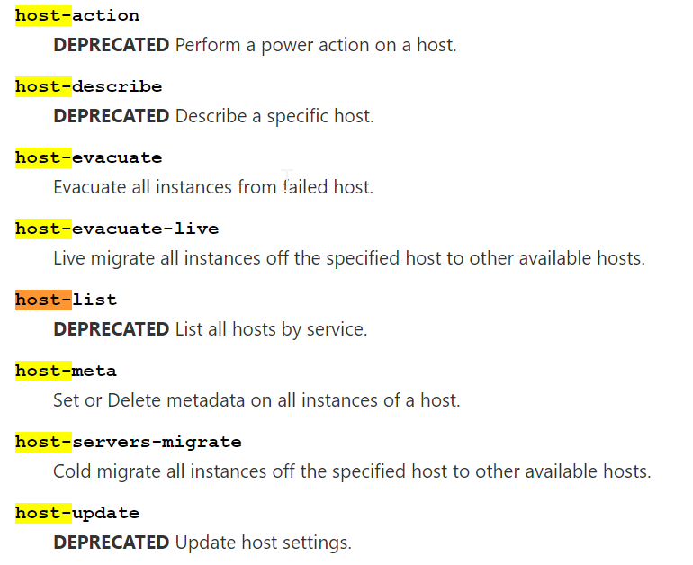
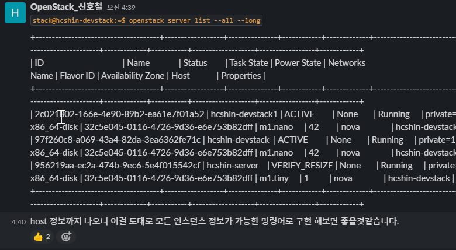
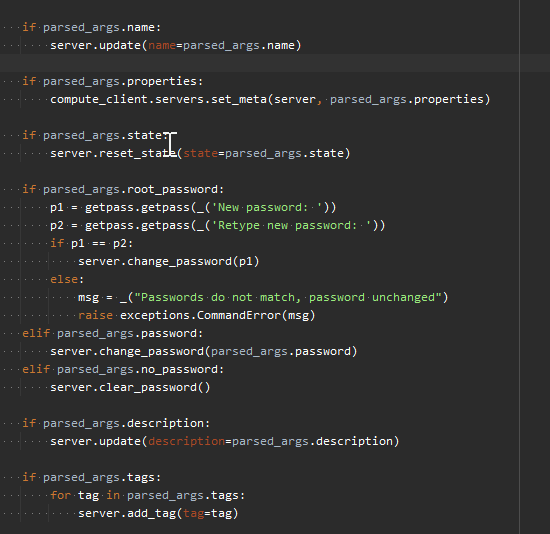

openstackclient에 hypervisor servers set 명령어 추가하기
=====================================================================

--------------------------------------------------------
# 미리보는 3줄 요약
--------------------------------------------------------

* nova client에 :code:`host-meta` 라는 명령어가 있음
* openstack cli는 구현되어 있지 않음
* :code:`hypervisors servers set` 명령어로 구현했음

--------------------------------------------------------
1. 시작
--------------------------------------------------------

'오픈소스 컨트리뷰톤 2021'의 OpenStack 팀에 참가하여 contribute 할 수 있는 항목을 찾는 도중 멘토님의 가이드에 따라 명령어 구현 프로젝트에 참가하여 구현을 수행하게 되었다.
오픈스택은 프로젝트가 여러 프로젝트가 어울려져 오픈스택 생태계를 이루어지는 형태로 되어있으며 각 프로젝트는 IaaS를 제공하기 위한 고유의 영역을 담당하고있다.
수많은 프로젝트가 있지만 대표적으로 몇 개를 적어보자면

* :code:`nova` : 가상머신 인스턴스를 관리하는 프로젝트
* :code:`glance` : 가상머신 인스턴스에 사용될 이미지를 관리하는 프로젝트
* :code:`keystone` : 오픈스택의 모든 인증을 담당
* :code:`neutron` : 가상 네트워크를 관리하고 물리 네트워크와의 연결을 담당

등이 있다. 실제론 이 프로젝트보다 훨씬 더 많다.
각 프로젝트는 CLI(Command Line Interface)를 별도로 제공하고 있으며 :code:`nova <command> [options]`, :code:`neutron <command> [options]` 와 같은 형태로 제공하고 있다.
오픈스택에선 이렇게 각 개별 프로젝트가 제공하는 CLI를 :code:`openstack <command> [options]` 와 같은 형태로 통합하려는 작업을 진행중이며 그 작업의 진행사항은 공식 문서 `Mapping Guide <https://docs.openstack.org/python-openstackclient/pike/cli/decoder.html>`_ 에서 볼 수 있다.

위 Mapping Guide 문서에서 아직 mapping 작업이 되지 않은 명령어를 우선 확인하였으며, OpenStack 팀은 glance, nova 팀으로 나누어 매핑되지 않은 명령어를 개인별로 하나씩 목표로 잡고 명령어 구현하는 프로젝트를 진행했으며 나는 nova팀에서 :code:`host-meta` 명령어를 openstack cli에 구현하는 작업을 수행하였다.

--------------------------------------------------------
2. 분석
--------------------------------------------------------
    
nova의 :code:`host-meta <host id>` 명령어는 호스트에 속해있는 서버(가상머신 인스턴스)의 metadata를 일괄 수정하는 명령어 인데 여기서 metadata란 서버가 가진 수많은 프로퍼티 중 :code:`property` 에 해당하는 항목이다. :code:`property` 는 :code:`key:value` 형태로 값을 저장할 수 있는 배열 속성이다. 이 속성은 nova 명령어의 :code:`nova server-show <server-id>` 명령어를 통해 볼 수 있는 세부 서버 정보 중 :code:`metadata` 항목에 해당한다.

.. code-block:: bash

    stack@wjs-develop:~$ nova show  09e57c6d-d173-4329-b5c8-0c55eabb9676
    +--------------------------------------+------------------------------------------------+
    | Property                                   | Value                                                                                         |
    +--------------------------------------+------------------------------------------------+
    | OS-DCF:diskConfig                    | AUTO                                                                                          |
    | OS-EXT-AZ:availability_zone   | nova                                                                                          |
    | OS-EXT-SRV-ATTR:host               | wjs-develop                                                                              |
    ...
    ...
    | metadata                                    | {"testKey1": "testValue1", "testKey2": "testKey2", ...       |
    ...

작업을 시작하기 위해선 먼저 아래 순서로 계획을 세우고 진행하였다.

1. 참고할 명령어 고르기 : :code:`host-meta <host id>` 와 가장 유사한 nova cli 중 openstack cli에 이미 구현되어 있는 명령어를 먼저 골라서
2. 구현, 차이점 확인하기 : nova cli에선 어떤식으로 구현되어있는지, openstack cli엔 어떤식으로 구현되어있는지 확인해서
3. 구현 작업 내용 파악하기 : 복사해서 활용할 수 있는 부분, 바꿔야 하는 부분, 새로 구현해야 하는 부분을 찾아서
4. 구현 : 구현한다.

--------------------------------------------------------
2. 명령어 고르기
--------------------------------------------------------

:code:`host-meta <host id>` 명령어와 비슷한 계열의 :code:`host-` 관련 명령어를 찾아보았다. `nova cli 공식 도큐먼트 <https://docs.openstack.org/python-novaclient/latest/cli/nova.html>`_ 를 찾아보면 host 관련 cli를 찾아볼 수 있는데 대부분의 host 관련 cli들이 `DEPRECATED` 상태인 것을 알 수 있었다.

이와 관련해서 `정보 <https://specs.openstack.org/openstack/nova-specs/specs/pike/implemented/deprecate-os-hosts.html>`_ 를 찾아보면 opensatck 에서 host 관련 개념들이 service, hypervisor로 분리되어 각 명령어와 http api들도 이에 맞게 변경되고 있음을 알 수 있다.

위 정보를 통해서 기존 host 계열 명령어에서 변경된 :code:`host-list` 명령어를 첫 번째 참고 타겟으로 하였으며 각 서버의 속성을 실제로 변경하기 위해 openstack cli에 구현되어 있는 :code:`server set` 명령어를 두 번째 참고 타겟으로 하였다.

--------------------------------------------------------
3. 구현, 차이점 확인하기
--------------------------------------------------------

nova의 cli 명령어는 모두 `nova http api <https://docs.openstack.org/api-ref/compute/>`_ 를 호출한다. `nova cli 프로젝트 <https://opendev.org/openstack/python-novaclient>`_ 를 클론받아 소스코드를 살펴보면 :code:`novaclient/v1/shell.py` 가 메인인 것을 알 수 있는데 이 중 :code:`host-meta <host id>` 를 담당하는 부분은 :code:`do_host_meta` 임을 알 수 있고 이 함수는 동일한 폴더의 :code:`servers.py` 의 :code:`set_meta`, :code:`delete_meta` 를 호출함을 알 수 있다. 이 메소드는 :code:`/servers/%s/metadata` 형태의 http api를 호출하는 것을 볼 수 있는데 `이 http api는 공식 문서 <https://docs.openstack.org/api-ref/compute/#create-or-update-metadata-items>`_ 에서도 확인할 수 있다. 또한 이를 통해 '호스트에 속한 모든 서버의 속성 변경'이 아니라 '호스트에 속한 서버들을 리스트업 하고 개별 서버 속성 변경 api 호출' 방식을 사용함을 알게되었다.

openstack의 cli도 nova와 똑같은 형태로 각 프로젝트의 http api를 호출하는 방식으로 동작하고 있으며 이제 nova의 명령어 구현 부분을 openstack cli로 옴겨서 구현하는데 기존 openstack cli 구현 스타일과 같은 방식으로 맞추는 것이 관건이였다.

--------------------------------------------------------
4. 신규 방향 설정
--------------------------------------------------------

무작정 옮기기엔 문제가 있었는데, :code:`host-meta` 명령어는 openstack cli에는 유사한 형태가 없는 스타일의 커맨드였다. openstack cli는 호스트에 대한 전체 리스트 조회(host list), 설정 변경(host set, enable/disable, enable-maintenance/disable-maintenance), 단일 세부 정보 조회(host show)만 있었고, `호스트에 속한 서버`를 타겟으로 하는 cli는 없었다.
그래서 새로운 컨셉의 명령어를 고민했어야 했고, 멘토님과 논의 도중에 구현할 새로운 명령어를 현재 :code:`host-meta` 가 하는 property만 변경하는 것이 아니라, 전체 속성을 변경하는 명령어로 구현하자는 의견을 주셨다. 

이에 따라 구현할 명령어는 :code:`hypervisor servers set` 구문이 기존 openstack cli 명령어들과 스타일이 유사할 것 같아서 해당 구문으로 정하였고, metadata만 변경하는 것이 아닌, 다른 속성을 변경하기 위한 코드를 추가로 분석해야 했다.

--------------------------------------------------------
5. 추가 분석
--------------------------------------------------------

단일 서버의 속성을 변경하는 명령어는 openstack cli에서 :code:`server set` 명령어로 이미 구현되어 있었으며 이 커맨트의 동작 코드를 분석하였다.

:code:`server set` 명령어의 실제 구현부는 :code:`openstackclient/compute/v2/server.py` 의 :code:`SetServer.take_action` 함수이다.

이 함수를 보면 특이하게 하나의 함수를 호출해서 값을 변경하는 것이 아니라 값마다 다른 함수를 호출함을 알 수 있다.

이 분석으로 서버 속성을 변경하기 위해선 각 속성에 맞는 함수를 호출해야 함을 알 수 있다.

--------------------------------------------------------
6. 구현하기, 테스트 코드 작성
--------------------------------------------------------

구현할 명령어를 :code:`hypervisor servers set` 로 정하였으므로 :code:`hypervisor` 관련 명령어들이 구현되어 있는 :code:`openstackclient/compute/v2/hypervisor.py` 파일에 :code:`class SetHypervisorServers` 를 구현하였다.

일단 description, tag, property를 변경하는 기능들을 우선 추가하기로 하였으며 아래 과정을 구현하기로 계획하였다.

1. 특정 hypervisor에 속한 서버 리스트를 모두 가져옴
2. 각 서버의 속성을 변경하기 위해 개별 함수를 호출함

명령어를 0부터 구현하는 것이 아니라 기존 명령어들의 구현들을 분석해서 기본 뼈대를 똑같이 사용하면서 내가 필요한 함수를 찾아서 호출하고 끼워 맞추는 형태로 작업하였다.

메인 코드를 구현하고 나서 테스트 코드를 작성하였는데 메인 코드보다 작성 시간이 2배정도 더 걸린 것 같다. 파이썬 코드조차 익숙하지 않은데 테스트 코드는 익숙할리가 없어서 기존 테스트 코드를 보면서 어떤식으로 해야할 지 참고를 많이하였고 결국 테스트를 통과하고 완성된 코드를 올릴 수 있게 되었다.

 * https://storyboard.openstack.org/#!/story/2009311
 * https://review.opendev.org/c/openstack/python-openstackclient/+/814792