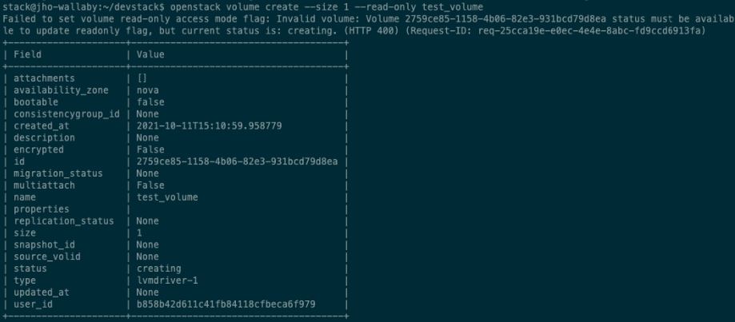
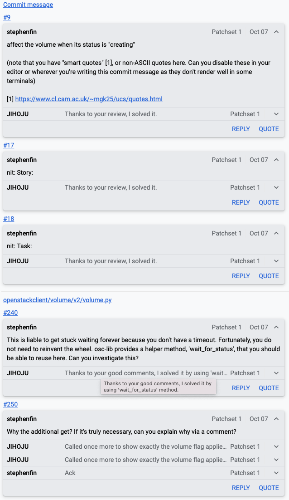

:orphan:

================================================================================================================
story#: Fix bug that readonly option doesn’t setup with volume create.
================================================================================================================

요약
-------
.. note::
    openstack volume create --size 1 --read-only <volume name> 명령어 수행 시 \'--read-only\' option을 주었지만 해당 option은
    처리가 안되고 에러 메세지를 출력하며 option이 적용되지 않은 volume이 생성되는 버그

0. PR 전 버그 수정 과정
------------------------------------------

openstack volume create --size 1 --read-only <volume name> 명령어 수행 시 readonly option에 대한 에러가 처리되며
readonly option이 적용되지 않은 volume이 생성된 것을 다음과 같이 확인할 수 있다.

해당 버그를 해결하기 위해 **python-openstackcli.openstackclient.volume.v2.volume.py** 파일 코드를 분석했습니다.

.. code-block:: python

   def update_readonly_flag(self, context, volume, flag):
        context.authorize(vol_action_policy.UPDATE_READONLY_POLICY,
                            target_obj=volume)
        if volume['status'] != 'available':
            msg = _('Volume %(vol_id)s status must be available '
                    'to update readonly flag, but current status is: '
                    '%(vol_status)s.') % {'vol_id': volume['id'],
                                          'vol_status': volume['status']}
            raise exception.InvalidVolume(reason=msg)
        self.update_volume_admin_metadata(context.elevated(), volume,
                                          {'readonly': str(flag)})
        LOG.info("Update readonly setting on volume "
                 "completed successfully.",
                 resource=volume)

**if volume[\'status\'] != \'available\'** : 해당 구문을 보면 volume.id 로 넘겨준 volume의 status가 available이
아니면 에러를 처리하게 되어 있다.

**volume_client.volumes.create** 으로 생성된 volume의 status가 바로 available이 되는 것이 아니라 잠시
creating 상태에 있기에 에러가 발생하며 --read-only 옵션이 처리가 되지 않았다.

이를 해결하기 위해 다음 코드와 같이 volume.py 에서 **volume의 api** 를 호출하여 상태 체크를 계속 해주었습니다.

.. code-block:: python

   # 추가 코드 1
   while volume.status == "creating":
        volume = volume_client.volumes.get(volume.id)

   if parsed_args.bootable or parsed_args.non_bootable:
        try:
            volume_client.volumes.set_bootable(
                volume.id, parsed_args.bootable)
        except Exception as e:
            LOG.error(_("Failed to set volume bootable property: %s"), e)
   if parsed_args.read_only or parsed_args.read_write:
        try:
            volume_client.volumes.update_readonly_flag(
                volume.id,
                parsed_args.read_only)
        except Exception as e:
            LOG.error(_("Failed to set volume read-only access "
                        "mode flag: %s"), e)
   # 추가 코드 2
   volume = volume_client.volumes.get(volume.id)

해당 버그를 수정하니 또 다른 에러를 발견했다.

readonly 옵션으로 volume 인스턴스를 생성한 결과 출력되는 volume 정보에는 --read-only option이 빠져있었지만
다시 show 명령어로 확인한 결과 정상적으로 readonly option이 적용이 되어 있었다.

원인
    **출력해주는 volume 값을 바꾸지 않아 readonly 옵션을 주어도 생성 결과 출력값에는 빠져있었던 것이었다.**

해결방안
    **모든 옵션을 처리하고 마지막에 volume api를 호출하여 volume 값을 업데이트 해주는 방향으로 코드를 수정했다.**

수정 코드를 tox를 통해 test case를 돌리던 중 에러가 발생했다. **추가 코드 2** 로 인해 발생하는 문제였다.

원인
    **test를 돌리면 fake volume object 의 get API 가 제대로 호출 되지 않아 에러가 발생했다.**

해결방안
    .. code-block:: python

       self.volumes_mock.get.return_value = self.new_volume

    **해당 명령어를 TestVolumeCreate class 의 setUp 메서드에 추가해주어 create fake_volume object 시 생성된
    fake object 가 get API 를 호출할 수 있게끔 수정했다.**

위와 같이 코드 수정을 마치고 첫번째 PR 을 올렸다.

1. 첫번째 PR 에 대한 리뷰 및 코드 수정
------------------------------------------------

첫번째 PR에 maintainer 님이 코드 리뷰 후 comment를 달아주셨다.

.. note::
    volume 의 status 가 \'available\' 이 될 때까지 while 문으로 묶어주면 무한 루프에 빠지는 위험이 있을 수 있으며 코드 상 보기에
    깔끔하지 않아 기존에 만들어진 \'wait_for_status\' 메서드를 활용해서 코드를 수정하라는 피드백을 받았다.

.. code-block:: python

   if parsed_args.read_only or parsed_args.read_write:
        sys.stdout.write("Waiting for volume to be created.\n")
        if utils.wait_for_status(
                volume_client.volumes.get,
                volume.id,
                success_status=['available'],
                error_status=['error'],
                sleep_time=1
        ):
            try:
                volume_client.volumes.update_readonly_flag(
                    volume.id,
                    parsed_args.read_only)
            except Exception as e:
                LOG.error(_("Failed to set volume read-only access "
                            "mode flag: %s"), e)

        volume = volume_client.volumes.get(volume.id)

maintainer 님이 주신 피드백을 통해 코드를 다음과 같이 수정 후 문제 없이 잘 동작하는 것을 확인했다.

하지만 test case 를 돌리는 중 \'wait_for_status\' 메서드 내에서 **무한루프** 가 도는 문제점을 확인했다.

이를 위해 \'wait_for_status\' 메서드 내 코드를 분석했다.

.. code-block:: python

   def wait_for_status(status_f,
                       res_id,
                       status_field='status',
                       success_status=['active'],
                       error_status=['error'],
                       sleep_time=5,
                       callback=None):
        while True:
            res = status_f(res_id)
            status = getattr(res, status_field, '').lower()
            if status in success_status:
                retval = True
                break
            elif status in error_status:
                retval = False
                break
            if callback:
                progress = getattr(res, 'progress', None) or 0
                callback(progress)
            time.sleep(sleep_time)
        return retval

**volume create API** 는 volume 의 status 의 return 값을 \'available\', \'creating\', \'error\' 만 있다고 공식문서에서 정의하고 있다.

하지만 test case 에선 랜덤으로 \'in_use\' status 를 받아 wait_for_status 에서 무한루프가 도는 것이다.
\'in_use\' status 값을 갖는 이유는 FakeVolume class 내 create_one_volume 메서드 내에서
fake volume status 값을 \'in_use\', \'available\' 을 랜던하게 갖게 한다.

해당 문제를 해결하고자 다음과 같이 코드를 수정했다.

.. code-block:: python

   # fakes.py
   class FakeVolume(object):
        """Fake one or more volumes."""

        @staticmethod
        def create_one_volume(attrs=None,
                              status=['available', 'in_use']):
        ...

   # test_volume.py
   self.new_volume = volume_fakes.FakeVolume.create_one_volume(
                status=['available']
            )

**FakeVolume** 객체가 생성될 때 status 를 받을 수 있도록 코드를 수정하고 이 메서드를 호출할 때는 \'available\' 만 status 를 가질 수 있도록
코드를 수정했다.

이처럼 모든 에러를 처리하고 2번째 PR을 올렸으며 현재 maintainer 님의 review 를 기다리고 있다.

Reference
------------------------------------------------

- `내 Gerrit PR 확인하기 <https://review.opendev.org/c/openstack/python-openstackclient/+/811006>`_
