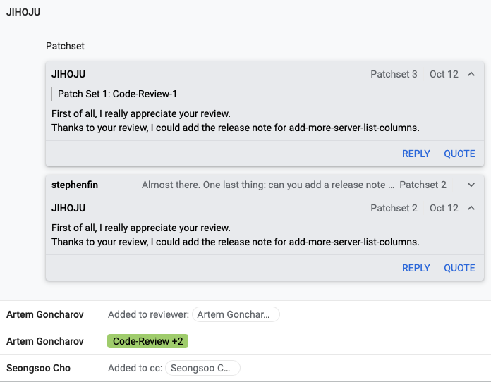

:orphan:

================================================================================================================
story#: Add more filter option of columns for server list -c COLUMN (기능 개선)
================================================================================================================

요약
-------
.. note::
    openstack server list \'-c\' option 을 주었을 때 \'--long\' option 의 column 들도 확인할 수 있게 기능을 개선했다.

0. PR 전 버그 수정 과정
------------------------------------------

Master Challenges 기간 중 멘토님이 내주신 3주차 과제를 수행하는 도중 \'--long\' option 에 해당하는 column 을
\'openstack server list -c <column명>\' 명령어를 통해 확인했지만 다음과 같은 Error 처리가 되었다.

.. code-block::

   stack@jho-wallaby:~/devstack$ openstack server list -c "Host"
   No recognized column names in ['Host']. Recognized columns are ('ID', 'Name', 'Status', 'Networks', 'Image', 'Flavor').

원인
    **python-openstackcli.compute.v2.server.py 에서 \'--long\' option 을 주지 않으면 해당 column 들을 처리할 수 없게 코드가 짜여 있었다.**

해결방안
    **\'--long\'** option 을 주지 않고도 \'-c\' option 만으로 해당 column 들을 처리할 수 있도록 코드를 수정하여 첫번째 PR을 올렸다.

1. 첫번째 PR 에 대한 리뷰 및 코드 수정
------------------------------------------------

첫번째 PR에 maintainer 님이 코드 리뷰 후 comment를 달아주셨다.

comment 내용 : **추가해준 기능이 잘 동작하는 지 test case 가 필요하다는 것이었다.**

해당 피드백을 받고 \'-c\' option 시 \'--long\' option 에 해당하는 column 들을 처리할 수 있도록 test code 를 수정했다.

2번째 PR을 올렸으며 maintainer 님께 2번째 리뷰를 받았다.

2. 두번째 PR 에 대한 리뷰 및 코드 수정
------------------------------------------------

두번째 review 에 대한 comment 내용은 \'add-more-server-list-columns\' 에 대한 release note 를 작성해달라는 것이었다.

releasenotes/notes/add-more-server-list-columns-4e3b87929dd330f7.yaml 파일 생성 후 다음과 같이 release note 를 작성했다.

.. code-block::

   ---
   feature:
   - |
      The ``server list`` command now allows users to select the following
      additional columns using the ``-c COLUMN`` option:
      - Task State
      - Power State
      - Image ID
      - Flavor ID
      - Availability Zone
      - Host
      - Properties
      These correspond to columns displayed by default when using the ``--long``
      option.

다음과 같이 release note 작성 후 3번째 PR을 올린 상태이며 maintainer 님의 review 를 기다리는 중이다.

Reference
------------------------------------------------

- `내 Gerrit PR 확인하기 <https://review.opendev.org/c/openstack/python-openstackclient/+/807420>`_

- `StoryBoard Issue Check <https://storyboard.openstack.org/#!/story/2009150>`_
