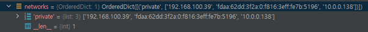

story#: openstack server show/list do not render a floating ip address properly
===========================================================================================================================================

Victoria
----------------------------------

server list 명령어는 osc-lib\\command.py에서 run 함수를 실행했을 때, DisplayCommandBase class의 run 함수로 넘어갑니다.

run 함수에서 가장 마지막으로 실행하는 produce_output 함수를 살펴보면 다음과 같은 내용이 있습니다.

.. code-block:: python
	
	def produce_output(self, parsed_args, column_names, data):
		...
		self.formatter.emit_list(
			columns_to_include, data, self.app.stdout, parsed_args,
		)

PrettyTable까지 만나는 건 과제에서도 봤던 내용입니다 :)

.. code-block:: python
	
	def emit_list(self, column_names, data, stdout, parsed_args):
		x = prettytable.PrettyTable(
			column_names,
			print_empty=parsed_args.print_empty,
		)
		x.padding_width = 1

		# Add rows if data is provided
		if data:
			self.add_rows(x, column_names, data)

.. code-block:: python
	
	def add_rows(self, table, column_names, data):
		
		data_iter = iter(data)
		try:
			first_row = next(data_iter)
			

next(data_iter)를 실행하면 take_action함수에서 봤던 get_item_properties함수를 처음 호출하는 부분으로 넘어갑니다.

victoria에서는 table을 구성할 때 Networks를 _format_servers_list_networks로 구현합니다.

.. code-block:: python
	
	table = (
		column_headers,
		(
			utils.get_item_properties(
				s, columns,
				mixed_case_fields=mixed_case_fields,
				formatters={
					'OS-EXT-STS:power_state':
					_format_servers_list_power_state,
					'Networks': _format_servers_list_networks,
					'Metadata': utils.format_dict,
				},
		...

get_item_properties 함수를 내려가다보면

.. code-block:: python
	
	for field in fields:
		if field in mixed_case_fields:
			field_name = field.replace(' ', '_')
		else:
			field_name = field.lower().replace(' ', '_')
		data = getattr(item, field_name, '')

fields에는 ID, Name, Status, Networks, Image Name, Flavor Name를 담은 tuple이 들어가있고, 값을 하나씩 꺼내와서 field_name을 지정해줍니다.

마지막 줄에서 data에 ordereddict타입의 network 주소가 들어갑니다.

    .. image:: images/2009122-2.png
        :height: 61
        :width: 602

get_item_properties 함수를 계속 보겠습니다.

.. code-block:: python
	
	if field in formatters:
		formatter = formatters[field]
		if (isinstance(formatter, type) and issubclass(
			formatter, cliff_columns.FormattableColumn)):
			data = formatter(data)
		elif callable(formatter):
			...
			if data is not None:
				data = formatter(data)

여기서 formatters는 맨 처음 table을 구성할 때 봤던 내용들이 들어갑니다.

networks 필드가 있기 때문에 formatter에는 _format_servers_list_networks 가 들어갑니다.

하지만 issubclass에 포함되지 않아서 elif의 if로 들어갑니다.

.. code-block:: python
	
	def _format_servers_list_networks(networks):
		
		"""Return a formatted string of a server's networks
		:param networks: a Server.networks field
		:rtype: a string of formatted network addresses
		"""
		
		output = []
		for (network, addresses) in networks.items():
			if not addresses:
				continue
			addresses_csv = ', '.join(addresses)
			group = "%s=%s" % (network, addresses_csv)
			output.append(group)
		return '; '.join(output)

이 함수가 종료되면 data가 ordereddict에서 str로 바뀝니다.

    .. image:: images/2009122-3.png
        :height: 30
        :width: 513

처음 봤던 add_rows 함수를 실행하다 보면 add_row 함수를 만납니다.

.. code-block:: python
	
	def add_rows(self, table, column_names, data):
		...
			# Now iterate over the data and add the rows.
			table.add_row(_format_row(first_row))
			

add_row는 _format_row의 결과를 가져옵니다.

.. code-block:: python
	
	def _format_row(row):
		new_row = []
		for r in row:
			if isinstance(r, columns.FormattableColumn):
				r = r.human_readable()
			if isinstance(r, str):
				r = r.replace('\r\n', '\n').replace('\r', ' ')
			new_row.append(r)
		return new_row

_format_row 함수에서 r이 string이 되고 이 타입은 columns.FormattableColumn에 없기 때문에
human_readable 함수를 거치지 못하고 new_row에 더해집니다.

즉, 정렬되지 않은 상태인 위에서 봤던 data대로 new_row에 더해집니다.

.. code-block:: python
	
	table = (
		column_headers,
		(
			utils.get_item_properties(
				s, columns,
				mixed_case_fields=mixed_case_fields,
				formatters={
					'OS-EXT-STS:power_state':
					_format_servers_list_power_state,
					'Networks': format_columns.DictListColumn,
					#'Networks': _format_servers_list_networks,
					'Metadata': utils.format_dict,
				},

network의 formatters를 wallaby에서 사용하는 DictListColumn으로 바꾸니 정렬된 상태로 출력되는걸 볼 수 있습니다.

    .. image:: images/2009122-4.png
        :height: 58
        :width: 602

Wallaby
-------------------------------------

    .. image:: images/2009122-5.png
        :height: 290
        :width: 503

wallaby에서는 victoria에서 썼던 _format_servers_list_networks가 없습니다.

.. code-block:: python

	python-openstackclient-stable_victoria\venv\Lib\site-packages\openstackclient\compute\v2\server.py

victoria에서 _format_servers_list_networks가 함수는 위 경로에 있었지만, openstackclient는 site-package에 없었습니다.

.. code-block:: python

	python-openstackclient\openstackclient\compute\v2\server.py

비슷한 경로를 찾아봤지만 wallaby에서는 찾을 수 없었습니다.

wallaby는 get_item_properties함수에서 DictListColumn이 issubclass에 있습니다.

.. code-block:: python
	
		if field in formatters:
			formatter = formatters[field]
			if (isinstance(formatter, type) and issubclass(
					formatter, cliff_columns.FormattableColumn)):
				data = formatter(data)
				

Data가 dictlistcolumn이 됩니다.

    .. image:: images/2009122-6.png
        :height: 23
        :width: 567

이어서 add_row -> _format_row 함수를 가면 victoria에서는 실행하지 못해던 human_readable 함수를 실행할 수 있습니다.

.. code-block:: python
	
	class DictListColumn(columns.FormattableColumn):
		"""Format column for dict, key is string, value is list"""
		def human_readable(self):
			return utils.format_dict_of_list(self._value)

.. code-block:: python
	
	def format_dict_of_list(data, separator='; '):
		for key in sorted(data):
			value = data[key]
			if value is None:
				continue
			value_str = format_list(value)
			group = "%s=%s" % (key, value_str)
			output.append(group)
		return separator.join(output)

.. code-block:: python
	
	def format_list(data, separator=', '):
		"""Return a formatted strings

		:param data: a list of strings
		:param separator: the separator to use between strings (default: ', ')
		:rtype: a string formatted based on separator
		"""
		if data is None:
			return None

		return separator.join(sorted(data))

format_dict_of_list 함수에서 format_list 함수를 호출하고, format_list 함수에서 정렬이 들어가게 됩니다.

따라서 이 이슈는 업데이트에 변경된 내용이고, 버그가 아닙니다.