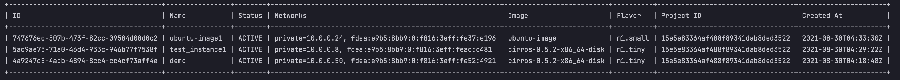

=================================================
3week - openstack server list 에 field 추가하기
=================================================

미션 1: openstack server list 의 기본 결과 필드에 "Project ID" 를 추가하기
미션 2: openstack server list 의 기본 결과 필드에 "Created At"를 추가하기

지난 2주차 ``openstack server list 명령어 동작 원리 파악`` 과제를 진행하면서, openstack server list 명령어에 대해서 하나씩 살펴볼 수 있었다.
그 중 ListServer 클래스의 take_action() 메소드에서 많은 필드 변수들이 있는 것을 볼 수 있었다.
뭔가 여기에 결과를 출력해주는 필드 부분이 있을 것 같았고 '여기에서 필드를 추가하면 어떨까?' 라는 생각을 하였고 추가 해보았다...!

take_action() 메소드를 천천히 내려가다 보면, search_opts라는 변수에 여러가지 값들을 넣는 것을 찾을 수 있었다.
.. image:: ../images/week2/week3-1.png
여기서 Project ID는 ``tenant_id``라는 변수명을 갖고있다는 것을 알 수 있었고, Created At은 ``created_at`` 이라는 변수명을 갖고 있다는 것을 알 수 있었다.

그 중, Project ID는 ``tenant_id`` , Created At은 ``created_at`` 을 coloumn에 추가해보았다.

.. code-block:: python

            if parsed_args.no_name_lookup:
                """생략"""
            else:
                columns = (
                    'ID',
                    'Name',
                    'Status',
                    'Networks',
                    'Image Name',
                    'Flavor Name',
                    'tenant_id', #Project ID 추가
                    'created_at', #Created At 추가
                )
            column_headers = (
                'ID',
                'Name',
                'Status',
                'Networks',
                'Image',
                'Flavor',
                'Project ID', #Project ID 추가
                'Created At', #Created At 추가
            )
            mixed_case_fields = []

.. image:: ../images/week2/week3-2.png

근데 이상하게 Created At 부분이 공백으로 나왔다,,(멘붕) 그래서 뭐지,,? 하고 있었는데, 우리 팀원 중 한분이 찾아내셔서 벌써 커밋까지 해놓으신게 아닌가..!
`created 출력 에러 commit <https://review.opendev.org/c/openstack/python-openstackclient/+/806464>`_

수정된 코드를 보니, 중간에 append 부분을 created로 변경해주면 잘 되는 것으로 보였다.
그래서 나도 변경사항을 참고하여 수정하고 출력해보았더니 정상적으로 출력되는 것을 볼 수 있었다..!

.. code-block:: python

            if parsed_args.no_name_lookup:
                """생략"""
            else:
                columns = (
                    'ID',
                    'Name',
                    'Status',
                    'Networks',
                    'Image Name',
                    'Flavor Name',
                    'tenant_id', #Project ID 추가
                    'created', #Created At 추가
                )
            column_headers = (
                'ID',
                'Name',
                'Status',
                'Networks',
                'Image',
                'Flavor',
                'Project ID', #Project ID 추가
                'Created At', #Created At 추가
            )
            mixed_case_fields = []

