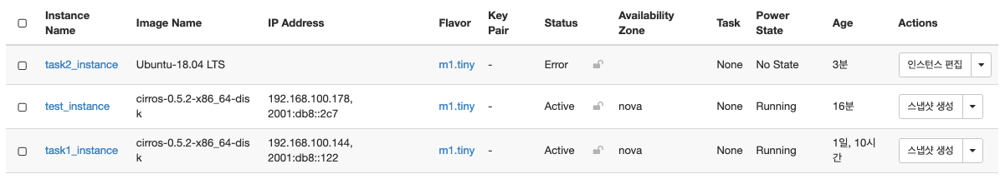
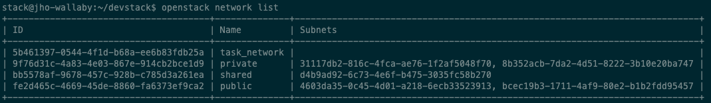

2week - CLI와 친해지기
==========================================================

OpenStack 환경변수 설정
------------------------
OpenStack Command 를 사용하기 위해 환경변수를 세팅해줘야 한다.

- 환경변수 설정을 안해주었을 경우

.. warning::
    Missing value auth-url required for auth plugin password 에러? 발생

따라서 **환경변수에 openstack authentication을 추가해줘야 한다.**

devstack 은 환경변수를 계정에 맞게 설정해주는 스크립트를 제공해준다.

.. code-block:: bash

   source openrc admi(사용자)n admin(프로젝트이름)

환경변수에 필요한 내용을 admin 사용자의 권한으로 읽어오고 admin 프로젝트를 default 로 바라보게 한다.
그 결과 openstack command (예: openstack server list) 가 잘 작동하는 것을 볼 수 있다.

OpenStack instance 생성
------------------------

.. code-block:: bash

   openstack server create --image=[가지고 있는 이미지] --flavor=[사양] --network=[public/private/shared] instance_name
   openstack [server, flavor, network] list # (server, flavor, image 등) list 출력

----------------------

ERROR
------------------------

CryptographyDeprecationWarning: int_from_bytes is deprecated, use int.from_bytes instead 에러
^^^^^^^^^^^^^^^^^^^^^^^^^^^^^^^^^^^^^^^^^^^^^^^^^^^^^^^^^^^^^^^^^^^^^^^^^^^^^^^^^^^^^^^^^^^^^^^^^^^^^^^^^^^^^^

openstackclient 를 사용하기 위해 openrc 파일을 사용해 다음과 같은 명령어를 수행

.. code-block:: bash

   source openrc admin admin

그러자 위와 같은 에러가 발생,,,

원인
    **an upstream bug with twisted's dependency**

해결방안
    - crytography < 3.4 와 같은 옛날 버전의 crytography 를 설치해야 한다.
    - 이 버전은 twisted's dependency를 만족하고 deprecation warings 를 throw 하지 않는다.
    - cd /opt/stack/devstack 에서 **pip install cryptography==3.3** 명령어를 수행하니 더이상 에러가 발생하지 않는다.

version 3.3을 선택한 이유는 3.4 이하 버전에서 가장 최신 버전이라 선택

----------------------

참조
------

- `<https://seungjuitmemo.tistory.com/170>`_
- `<https://velog.io/@dojun527/OpenStack-CLI-%EC%82%AC%EC%9A%A9%ED%95%98%EA%B8%B0>`_

|

2. ubuntu 이미지를 받고, root password를 설정 후 cli로 이미지 등록한 후 인스턴스 생성하고 접속하기
--------------------------------------------------------------------------------------------------

1. Ubuntu image 받기
------------------------
OpenStack 용 우분투 이미지는 일반 OS 이미지를 사용하는 것이 아니라 클라우드용으로 생성해 놓은 이미지를 생성해놔야 한다. 원하는 이미지로 인스턴스를 생성하기 위해서는 이미지 파일을 받아서 오픈스택 대쉬보드에 업로드를 해야한다.

- 이미지 공금원 사이트 : `Ubuntu Cloud Images <https://velog.io/@dojun527/OpenStack-CLI-%EC%82%AC%EC%9A%A9%ED%95%98%EA%B8%B0>`_ (해당 링크는 OpenStack 공식문서 Ubuntu 18.04 LTS (Bionic Beaver) Daily Build 로 다운 링크가 걸려있다.)

.. note::
    **bionic/current/ 폴더에서 가급적으로 bionic-server-cloudimg-amd64.img를 다운 받을 것을 권장**

    If your deployment uses QEMU or KVM, we recommend using the images in qcow2 format, with name ending in .img. **The most recent version of the 64-bit amd64-arch QCOW2 image for Ubuntu 18.04 is bionic-server-cloudimg-amd64-disk.img**

다운로드 과정
---------------

1. image를 일단 내 로컬 컴퓨터로 받았다.
2. 뭘 어떻게 해야하지...? 이미지를 다운 받으면 비밀번호를 초기화 해줘야 한단다. (아마 root password를 설정이 이 말 이겠지??) ⇒ 근데 왜 초기화?
3. 이 image를  VM이 있는 곳으로 옮겨야 할 거 같다.
4. 차라리 리눅스 명령어 **wget** 를 사용해서 **devstack 내부** 에서 다운로드 받아보자.
5. openstack image list 명령어를 사용하면 다운로드 받은 image가 안뜬다.
6. 일단 root password를 설정한 다음 cli로 이미지를 등록해야 보일 거 같다.

참조
--------
- `<https://docs.openstack.org/image-guide/obtain-images.html>`_

2. root password 설정
------------------------
**Ubuntu Cloud Image는 default username/password 가 없다.** 그래서 **해당 image 로 instance 를 생성하기 전에 root password 설정이 필요** 하다.
**virt-customize** 라는 툴을 이용하여 image root password 를 설정해주자.
그 전에 해당 cmd 를 사용하기 위해선 **libguestfs-tools pkg** 를 다운 받아야 한다.

.. code-block:: bash

   sudo apt install libguestfs-tools

위와 같이 pkg 를 설치했다면 다음과 같은 명령어로 root password 를 변경해보자

.. code-block:: bash

   # 여기선 password 를 secret 으로 설정했다.
   sudo virt-customize -a bionic-server-cloudimg-amd64.img --root-password password:secret

root password 설정 과정
--------------------------
1. image 파일을 받고 이 파일 내부의 root password를 설정해주는건가??? 라고 맨 처음 이해.
2. 공식문서에서도 못 찾겠고 구글링을 계속해도 못 찾았다. 이건 아닌거 같다 라고 생각.
3. root password 가 현재 오픈스택 devstack의 root 계정의 비밀번호를 말하는 거라고 생각.
4. 생각해보니 stack 계정을 생성할 때 root 계정으로 생성했어야 했는데 sudo 명령어로 해서 된건가??
    - sudo (superuser do) 명령어 : 현재 계정에서 root 권한을 이용하여 명령어를 실행
    - /etc/sudoers 파일에 지정된 사용자만 sudo 명령어를 사용 가능 ⇒ ssh 로 접속하고 ubuntu@jho-wallaby는 뭐지,,.? 바로 권한 사용이 가능한건가??
5. 그래서 root 계정 Password Setting 함!!!

.. code-block:: bash

   sudo passwd root

6. 결국 잘못 생각했다는 것을 깨달음,,,!!!
    - OpenStack images에 대한 root password를 설정해줘야한다!! (`2. root password 설정`_)

참조
------
- `<http://charmingwebdesign.com/how-to-set-a-root-password-for-your-openstack-images-2/>`_
- `<https://velog.io/@dojun527/이미지-생성하기>`_
- `<https://askubuntu.com/questions/451673/default-username-password-for-ubuntu-cloud-image>`_
- `<https://jaeho.tistory.com/entry/cloud-image-root-password-설정>`_

3. cli로 image 등록하기
------------------------
Ubuntu Cloud Image 를 OpenStack 에 등록하는 글들을 읽고 다음과 같은 명령어 수행.

.. code-block:: bash

   # 여기선 network 를 public 으로 지정했다.
   openstack image create "Ubuntu-18.04 LTS" --file bionic-server-cloudimg-amd64.img --disk-format qcow2 --container-format=bare --public

.. image:: images/image_create.png

다음과 같은 결과로 Ubuntu image OpenStack 에 등록!!!

참조
--------
- `<https://velog.io/@dojun527/OpenStack-CLI-사용하기>`_
- `<https://docs.openstack.org/glance/pike/admin/manage-images.html>`_
- `<https://computingforgeeks.com/adding-images-openstack-glance/>`_

4. 인스턴스 생성하기
------------------------------------

Openstack instance 생성

.. code-block:: bash

   openstack server create --image=<image_name> --flavor=<flavor_name> --network=<network_name> <instance_name>
   # 예) openstack server create --image=Ubuntu-18.04 LTS --flavor=m1.tiny --network=public task2_instance

------------------

ERROR
------------------------

Error 1
-----------------------

.. image:: images/error1.png

다음과 같은 에러 발생!!!

- 분명 틀린게 없는데 그래서 혹시 image name 입력할때 띄어쓰기가 있어서 이걸 <server name>으로 인식하는 건 아닌지? 의심...
- 또 image를 Ubuntu-18.04 LTS 가 아니라 cirros (기존에 있던 이미지) 로 만들어보니 바로 생성됨....
- 이미지 이름을 바꿔보자!!!

.. code-block:: bash

   openstack image set --name=Ubuntu-18.04 Ubuntu-18.04 LTS

그 결과 **openstack image set: error: unrecognized arguments: LTS 에러가 발생**

혹시,,, **—image=\"Ubuntu-18.04 LTS\"** 같이 \"\" 를 붙여보자 ⇒ 역시나 된다,,,

.. code-block:: bash

   openstack server create --image="Ubuntu-18.04 LTS" --flavor=m1.tiny --network=public task2_instance

Error 2
----------------

인스턴스를 생성은 됐는데 다음 명령어 수행 결과가 다음과 같이 나타났다.

.. code-block:: bash

   openstack server list

.. image:: images/error2-1.png

openstack dashboard 에 들어가니 Status 가 Error 로 나와있다.

인스턴스 개요에 Fault 메세지를 보니 다음과 같다.

.. image:: images/error2-3.png

Error 2 발생 이유
    **image의 크기가 Flavor disk 사이즈를 초과해버린 것**

해결방안
    **해당 인스턴스의 Flavor disk 사이즈를 m1.tiny 보다 큰 ds512M 으로 변경해주자!!!!**

    .. code-block:: bash

        openstack server resize --flavor "flavor_name" "instance_name"

Error 3
----------------

.. image:: images/error3.png

Error 3 발생 추측
    아마 지금 vm_state 가 Error 이기 때문에 해당 instance 에 **resize** 같은 명령을 못내리는 거 같다.
    그럼 인스턴스를 삭제하고 다시 만들어야 되나,,,,일단 flavor는 nova 영역이고,,, 그것보다 status가 error니 명령어도 듣지 않고 통신이 안되는 거 같다.

해결 방안
    **status가 error 이면 인스턴스를 삭제하고 다시 생성해야 한다.**

----------------------

5. 접속하기
------------------------

콘솔을 통해 위에서 생성한 instance 에 access 해보자

.. code-block:: bash

        openstack console url show instance_name

다음과 같은  결과가 확인되었다.

.. image:: images/connect1.png

- protocol: **vnc**
    - Virtual Network Computing 의 약자로 VM에 원격 콘솔 액세스를 위한 오픈 소스 GUI 및 CLI 도구로 Compute에서 지원한다.
- type: **novnc**
    - **novnc** : 웹 브라우저를 통해 VNC support를 제공한다
- url: http://211.37.148.128:6080/vnc_lite.html?path=%3Ftoken%3Df90bea97-8c12-49b8-bdbc-a1e79f16f985

웹 브라우저에서 해당 url를 통해 인스턴스에 접속하자 (root 계정)

>>> ubuntu login: root
>>> Password: "위에서 지정해준 password"

아~ 이래서 위에서 root password를 설정해줬구나,,,

.. image:: images/connect2.png

웹 브라우저에서 해당 인스턴스에 접속한 것을 볼 수 있다.

참조
---------

- `<https://docs.openstack.org/ocata/user-guide/cli-access-instance-through-a-console.html>`_
- `<https://docs.openstack.org/nova/latest/admin/remote-console-access.html>`_

|

3. cli로 floating ip 생성 후 인스턴스에 할당 / 해제 해보기
-----------------------------------------------------------

Floating IP 는 Fixed IP 처럼 자동으로 인스턴스에 default 로 할당되어 있지 않기 때문에 직접 인스턴스에 attach 해줘야 한다. 사용자들은 external network 로부터 인스턴스에 대한 연결성을 보장해주기 위해 cloud administrator 에 의해 정의된 다른 pool 부터 floating IP를 **grab** 해와야 한다.
(참고: `Blog <https://www.mirantis.com/blog/configuring-floating-ip-addresses-networking-openstack-public-private-clouds/>`_)

1. Floating IP 생성 후 인스턴스에 할당
---------------------------------------

솔직히 여기선 cloud administrator 가 정의한 다른 pool 이 뭔지 모르겠다. 하지만, **default 로 floating Ip address 는 public pool 로 부터 할당된다.**

다음과 같은 command로 floating address 를 현재 VM에 할당해보자.

.. code-block:: bash

   openstack floating ip create public

할당된 IP address 결과는 다음과 같다

.. image:: images/3-1.png

그런 다음과 같은 command 로 생성된 floating IPs 를 확인해보자

.. code-block:: bash

   openstack floating ip list

.. image:: images/3-2.png

그 결과 floating ip address 가 생성된 것을 확인할 수 있다.

그런 다음 command 로 생성된 floating ip address 를 instance 와 연결시켜주자.

.. code-block:: bash

   openstack server add floating ip "instance_name" "floating_ip_address"
   # openstack server add floating ip test_instance

Error 가 발생했다...

`공식문서 <https://docs.openstack.org/ocata/user-guide/cli-manage-ip-addresses.html>`_ 에서는 Private IP가 할당된 인스턴스에 floating ip를 할당해줘서 혹시나 해서 Private IP 로 설정해서 만든 인스턴스에 위와 같은 과정으로 floating ip address 를 해당 instance와 연결해줬더니 아무 이상 없이 floating IP가 할당되었다.

.. image:: images/3-3.png

위와 같이 floating ip가 인스턴스에 할당된 것을 볼 수 있다.

2. Floating IP 인스턴스에서 해제
---------------------------------------

인스턴스로부터 floating IP address 를 해제하기 위해 다음 command로 해제해주자.

.. code-block:: bash

   openstack server remove floating ip INSTANCE_NAME_OR_ID FLOATING_IP_ADDRESS

한 프로젝트로부터 floating IP address를 제거하기 위한 command 는 다음과 같다.

.. code-block:: bash

   openstack floating ip delete FLOATING_IP_ADDRESS

**제거된 IP 는 모든 프로젝트에서 이용 가능한 IP addresses 의 pool 로 리턴** 된다. 만약 **삭제한 IP address가 running instance에 할당되어 있으면 자동적으로 그 instance와 해제** 된다.

---------------------------

ERROR
------------------------

**생성한 floating ip address 를 instance 에 associate 해주는 과정에서 발생했다.**

.. warning::
    ResourceNotFound: 404: Client Error for url: http://211.37.148.128:9696/v2.0/floatingips/d47567b0-9a41-4aec-b733-d9b0d6a3cf26, External network **fe2d465c-4669-45de-8860-fa6373ef9ca2** is not reachable from subnet **bcec19b3-1711-4af9-80e2-b1b2fdd95457** . Therefore, cannot associate Port **7a8c850c-152b-434b-b900-2206375fc0a4** with a Floating IP.

- Instance Info
    - Image: cirros (default)
    - IP address: **Public(public=192.168.100.178, 2001:db8::2c7)**
    - Flavor: m1.tiny
- fe2d465c-4669-45de-8860-fa6373ef9ca2 : openstack public network ID
- bcec19b3-1711-4af9-80e2-b1b2fdd95457 : openstack public-subnet ID
- 7a8c850c-152b-434b-b900-2206375fc0a4 : ip_address=\'192.168.100.178\', subnet_id=\'bcec19b3-1711-4af9-80e2-b1b2fdd95457\'

`공식문서 <https://docs.openstack.org/ocata/user-guide/cli-manage-ip-addresses.html>`_ 에서는 Private IP가 할당된 인스턴스에 floating ip를 할당해줘서 혹시나 해서 Private IP 로 설정해서 만든 인스턴스에 위와 같은 과정으로 floating ip address 를 해당 instance와 연결해줬더니 아무 이상 없이 floating IP가 할당되었다.

.. image:: images/3-3.png

위와 같이 floating ip가 인스턴스에 할당된 것을 볼 수 있다.

Error 발생 이유
    public 네트워크로 인스턴스를 생성 시 생성된 인스턴스는 Clound VM 의 가상 네트워크를 사용하는 것이 아닌 실제로 존재하는 네트워크 주소를 가진 것이다. 현재 생성한 Floating IP 는 public pool 에서 가져온 것(실존 네트워크)이니 굳이 이 Floating IP 를 public 네트워크로 생성한 인스턴스에 할당해줄 필요가 없다. 서로 실존하는 네트워크가 겹쳐? 에러가 난 것이다.

해결 방안
    **public 이 아닌 private 네트워크로 생성한 인스턴스에 floating IP를 할당해주도록 하자!!!!**

참조
----------

- `<https://www.mirantis.com/blog/configuring-floating-ip-addresses-networking-openstack-public-private-clouds/>`_
- `<https://docs.openstack.org/ocata/user-guide/cli-manage-ip-addresses.html>`_
- `<https://help.dreamhost.com/hc/en-us/articles/215912768-Managing-floating-IP-addresses-using-the-OpenStack-CLI>`_

|

4. 10.8.0.0/24 네트워크를 만들고 public network와 연결하는 과정을 cli로 해보기
------------------------------------------------------------------------------

먼저 GUI 로 네트워크를 생성하고 public network 와 연결하는 과정을 진행해보며 CLI 로 하는 과정에서 어떤 옵션을 줘야하는지 파악하기로 했다.

1. GUI 과정
---------------------------------------

여기선 CLI에 필요한 것들이 무엇인지 파악을 하기 위함이므로 과정을 담은 사진은 따로 첨부를 하지 않았다.

네트워크 생성
-----------------

1. demo project에서 네트워크로 들어가 네트워크 생성을 해준다.
2. **네트워크 이름** 을 설정해주고 서브넷 생성 체크박스에 체크를 해준다.
3. **서브넷 이름** 을 설정 후 네트워크 주소 원본은 네트워크 주소 수동 입력 으로 선택해준 다음 **네트워크 주소** 는 멘토님이 정해주신 **10.8.0.0/24** 로 설정해준다.
4. 게이트웨이 IP를 설정해주지 않으면 설정 네트워크의 첫번째 값이 기본값으로 할당되니 주소를 적어두지 않고 넘어가도록 한다.
5. 서브넷 세부 정보에서 DHCP 사용 체크 박스를 체크(default로 체크되어 있음) 후 생성 버튼을 눌러주면 네트워크가 생성된 것을 볼 수 있다.

Public network 와 연결
---------------------------

위의 과정의 결과로 가상 네트워크 10.8.0.0/24 범위의 네트워크가 생성 되었다. 이제 public network 와 연결해주기 위해선 **1. 현재 public network 에 연결된 라우터에 인터페이스를 생성** 하거나 **2. 외부 네트워크를 public 으로 설정한 라우터를 생성해주고 인터페이스를 생성** 해서 가상 네트워크와 public network 를 연결해주면 된다.
지금은 이미 존재하는 라우터에 인터페이스를 추가해주겠다.

1. public network에 연결된 라우터를 클릭한다.
2. **인터페이스** 추가 버튼을 누른다.
3. 위에서 **서브넷 옵션에서 지정된 서브넷을  선택** 후 제출한다.
    - IP 옵션에 IP 주소를 지정하지 않으면 선택한 서브넷의 게이트웨이 IP 주소가 새로 만든 인터페이스의 IP 주소로 사용된다.
    - 그러므로 지정해주지 않았다.
4. 그 결과 위에서 생성된 가상 네트워크와 public network 가 연결된 것을 네트워크 토폴로지에서 볼 수 있을 것이다.

2. CLI 과정
---------------------------------------

CLI 를 통해 생성해야 되는 것 & 각 옵션들
    - network
        - **네트워크 이름**
    - subnet
        - **서브넷 이름**
        - **네트워크 주소 range**
        - **서브넷을 서브넷팅 해줄 네트워크 이름(위에서 생성한 네트워크 이름)**
    - interface
        - **router에 연결할 서브넷 이름**

2.1 네트워크 생성
-----------------------

.. code-block:: bash

   openstack network create <네트워크 이름>

다음 command 를 수행하면 다음과 같이 네트워크가 생성된 것을 볼 수 있다.

.. image:: images/4-1.png

아직 subnet를 지정해주지 않아 subnets 옵션에 값이 없는 것을 볼 수 있다.

2.2 서브넷 생성
---------------------

.. code-block:: bash

   openstack subnet create --network=<연결 네트워크 이름> --subnet-range=<네트워크 지정 범위> <서브넷 이름>

다음 command 를 수행하여 다음과 같은 결과를 얻었다.

.. image:: images/4-3.png

subnet 생성 후 network 에 지정해주니 task_network 의 Subnets 옵션에 값이 생긴 것을 볼 수 있다.

.. image:: images/4-4.png

2.3 Public network 에 연결하기
----------------------------------

라우터에 연결할 Subnet의 인터페이스를 생성해주어야 한다.

.. code-block:: bash

   openstack router add subnet <라우터 이름> <서브넷 이름>

다음 command 를 수행한 결과 router 에 해당 subnet 인터페이스가 생성된 걸 볼 수 있다.

.. image:: images/4-5.png

참조
-----

- `<https://docs.openstack.org/newton/ko_KR/install-guide-obs/launch-instance-networks-selfservice.html>`_
- `<https://docs.openstack.org/liberty/ko_KR/install-guide-obs/launch-instance-networks-private.html>`_
- `<https://engkimbs.tistory.com/622>`_