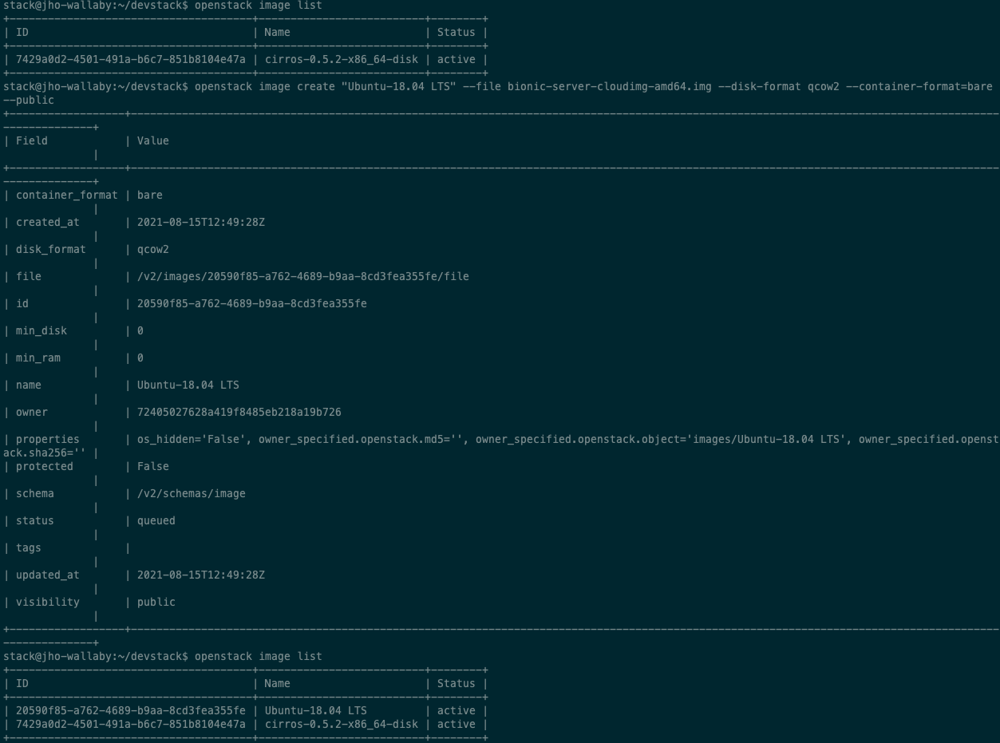
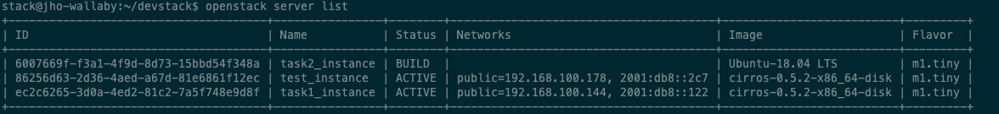

2. ubuntu 이미지를 받고, root password를 설정 후 cli로 이미지 등록한 후 인스턴스 생성하고 접속하기
=========================================================================================================

1. Ubuntu image 받기
------------------------
OpenStack 용 우분투 이미지는 일반 OS 이미지를 사용하는 것이 아니라 클라우드용으로 생성해 놓은 이미지를 생성해놔야 한다. 원하는 이미지로 인스턴스를 생성하기 위해서는 이미지 파일을 받아서 오픈스택 대쉬보드에 업로드를 해야한다.

- 이미지 공금원 사이트 : `Ubuntu Cloud Images <https://velog.io/@dojun527/OpenStack-CLI-%EC%82%AC%EC%9A%A9%ED%95%98%EA%B8%B0>`_ (해당 링크는 OpenStack 공식문서 Ubuntu 18.04 LTS (Bionic Beaver) Daily Build 로 다운 링크가 걸려있다.)

.. note::
    **bionic/current/ 폴더에서 가급적으로 bionic-server-cloudimg-amd64.img를 다운 받을 것을 권장**

    If your deployment uses QEMU or KVM, we recommend using the images in qcow2 format, with name ending in .img. **The most recent version of the 64-bit amd64-arch QCOW2 image for Ubuntu 18.04 is bionic-server-cloudimg-amd64-disk.img**

다운로드 과정
"""""""""""""
1. image를 일단 내 로컬 컴퓨터로 받았다.
2. 뭘 어떻게 해야하지...? 이미지를 다운 받으면 비밀번호를 초기화 해줘야 한단다. (아마 root password를 설정이 이 말 이겠지??) ⇒ 근데 왜 초기화?
3. 이 image를  VM이 있는 곳으로 옮겨야 할 거 같다.
4. 차라리 리눅스 명령어 **wget** 를 사용해서 **devstack 내부** 에서 다운로드 받아보자.
5. openstack image list 명령어를 사용하면 다운로드 받은 image가 안뜬다.
6. 일단 root password를 설정한 다음 cli로 이미지를 등록해야 보일 거 같다.

참조
""""
- `<https://docs.openstack.org/image-guide/obtain-images.html>`_

2. root password 설정
------------------------
**Ubuntu Cloud Image는 default username/password 가 없다.** 그래서 **해당 image 로 instance 를 생성하기 전에 root password 설정이 필요** 하다.
**virt-customize** 라는 툴을 이용하여 image root password 를 설정해주자.
그 전에 해당 cmd 를 사용하기 위해선 **libguestfs-tools pkg** 를 다운 받아야 한다.

.. code-block:: bash

   sudo apt install libguestfs-tools

위와 같이 pkg 를 설치했다면 다음과 같은 명령어로 root password 를 변경해보자

.. code-block:: bash

   # 여기선 password 를 secret 으로 설정했다.
   sudo virt-customize -a bionic-server-cloudimg-amd64.img --root-password password:secret

root password 설정 과정
""""""""""""""""""""""""""
1. image 파일을 받고 이 파일 내부의 root password를 설정해주는건가??? 라고 맨 처음 이해.
2. 공식문서에서도 못 찾겠고 구글링을 계속해도 못 찾았다. 이건 아닌거 같다 라고 생각.
3. root password 가 현재 오픈스택 devstack의 root 계정의 비밀번호를 말하는 거라고 생각.
4. 생각해보니 stack 계정을 생성할 때 root 계정으로 생성했어야 했는데 sudo 명령어로 해서 된건가??
    - sudo (superuser do) 명령어 : 현재 계정에서 root 권한을 이용하여 명령어를 실행
    - /etc/sudoers 파일에 지정된 사용자만 sudo 명령어를 사용 가능 ⇒ ssh 로 접속하고 ubuntu@jho-wallaby는 뭐지,,.? 바로 권한 사용이 가능한건가??
5. 그래서 root 계정 Password Setting 함!!!

.. code-block:: bash

   sudo passwd root

6. 결국 잘못 생각했다는 것을 깨달음,,,!!!
    - OpenStack images에 대한 root password를 설정해줘야한다!! (`2. root password 설정`_)

참조
""""
- `<http://charmingwebdesign.com/how-to-set-a-root-password-for-your-openstack-images-2/>`_
- `<https://velog.io/@dojun527/이미지-생성하기>`_
- `<https://askubuntu.com/questions/451673/default-username-password-for-ubuntu-cloud-image>`_
- `<https://jaeho.tistory.com/entry/cloud-image-root-password-설정>`_

3. cli로 image 등록하기
------------------------
Ubuntu Cloud Image 를 OpenStack 에 등록하는 글들을 읽고 다음과 같은 명령어 수행.

.. code-block:: bash

   # 여기선 network 를 public 으로 지정했다.
   openstack image create "Ubuntu-18.04 LTS" --file bionic-server-cloudimg-amd64.img --disk-format qcow2 --container-format=bare --public

다음과 같은 결과로 Ubuntu image OpenStack 에 등록!!!

참조
""""
- `<https://velog.io/@dojun527/OpenStack-CLI-사용하기>`_
- `<https://docs.openstack.org/glance/pike/admin/manage-images.html>`_
- `<https://computingforgeeks.com/adding-images-openstack-glance/>`_

4. 인스턴스 생성하기 (`ERROR`_)
------------------------------------

Openstack instance 생성

.. code-block:: bash

   openstack server create --image=<image_name> --flavor=<flavor_name> --network=<network_name> <instance_name>
   # 예) openstack server create --image=Ubuntu-18.04 LTS --flavor=m1.tiny --network=public task2_instance

------------------

ERROR
------------------------

Error 1
""""""""""""""""""""""""""

.. image:: images/error1.png

다음과 같은 에러 발생!!!

- 분명 틀린게 없는데 그래서 혹시 image name 입력할때 띄어쓰기가 있어서 이걸 <server name>으로 인식하는 건 아닌지? 의심...
- 또 image를 Ubuntu-18.04 LTS 가 아니라 cirros (기존에 있던 이미지) 로 만들어보니 바로 생성됨....
- 이미지 이름을 바꿔보자!!!

.. code-block:: bash

   openstack image set --name=Ubuntu-18.04 Ubuntu-18.04 LTS

그 결과 **openstack image set: error: unrecognized arguments: LTS 에러가 발생**

혹시,,, **—image=\"Ubuntu-18.04 LTS\"** 같이 \"\" 를 붙여보자 ⇒ 역시나 된다,,,

.. code-block:: bash

   openstack server create --image="Ubuntu-18.04 LTS" --flavor=m1.tiny --network=public task2_instance

Error 2
""""""""""""""""""""""""""

인스턴스를 생성은 됐는데 다음 명령어 수행 결과가 다음과 같이 나타났다.

.. code-block:: bash

   openstack server list

openstack dashboard 에 들어가니 Status 가 Error 로 나와있다.

.. image:: images/error2-2.png

인스턴스 개요에 Fault 메세지를 보니 다음과 같다.

.. image:: images/error2-3.png

Error 2 발생 이유
    **image의 크기가 Flavor disk 사이즈를 초과해버린 것**

해결방안
    **해당 인스턴스의 Flavor disk 사이즈를 m1.tiny 보다 큰 ds512M 으로 변경해주자!!!!**

    .. code-block:: bash

        openstack server resize --flavor "flavor_name" "instance_name"

Error 3
""""""""""""""""""""""""""

.. image:: images/error3.png

Error 3 발생 추측
    아마 지금 vm_state 가 Error 이기 때문에 해당 instance 에 **resize** 같은 명령을 못내리는 거 같다.
    그럼 인스턴스를 삭제하고 다시 만들어야 되나,,,,일단 flavor는 nova 영역이고,,, 그것보다 status가 error니 명령어도 듣지 않고 통신이 안되는 거 같다.

해결 방안
    **status가 error 이면 인스턴스를 삭제하고 다시 생성해야 한다.**

----------------------

5. 접속하기
------------------------

콘솔을 통해 위에서 생성한 instance 에 access 해보자

.. code-block:: bash

        openstack console url show instance_name

다음과 같은  결과가 확인되었다.

.. image:: images/connect1.png

- protocol: **vnc**
    - Virtual Network Computing 의 약자로 VM에 원격 콘솔 액세스를 위한 오픈 소스 GUI 및 CLI 도구로 Compute에서 지원한다.
- type: **novnc**
    - **novnc** : 웹 브라우저를 통해 VNC support를 제공한다
- url: http://211.37.148.128:6080/vnc_lite.html?path=%3Ftoken%3Df90bea97-8c12-49b8-bdbc-a1e79f16f985

웹 브라우저에서 해당 url를 통해 인스턴스에 접속하자 (root 계정)

>>> ubuntu login: root
>>> Password: "위에서 지정해준 password"

아~ 이래서 위에서 root password를 설정해줬구나,,,

.. image:: images/connect2.png

웹 브라우저에서 해당 인스턴스에 접속한 것을 볼 수 있다.

참조
""""""

- `<https://docs.openstack.org/ocata/user-guide/cli-access-instance-through-a-console.html>`_
- `<https://docs.openstack.org/nova/latest/admin/remote-console-access.html>`_