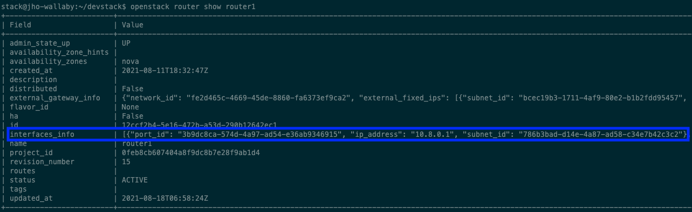

4. 10.8.0.0/24 네트워크를 만들고 public network와 연결하는 과정을 cli로 해보기
=====================================================================================

먼저 GUI 로 네트워크를 생성하고 public network 와 연결하는 과정을 진행해보며 CLI 로 하는 과정에서 어떤 옵션을 줘야하는지 파악하기로 했다.

1. GUI 과정
---------------------------------------

여기선 CLI에 필요한 것들이 무엇인지 파악을 하기 위함이므로 과정을 담은 사진은 따로 첨부를 하지 않았다.

네트워크 생성
"""""""""""""

1. demo project에서 네트워크로 들어가 네트워크 생성을 해준다.
2. **네트워크 이름** 을 설정해주고 서브넷 생성 체크박스에 체크를 해준다.
3. **서브넷 이름** 을 설정 후 네트워크 주소 원본은 네트워크 주소 수동 입력 으로 선택해준 다음 **네트워크 주소** 는 멘토님이 정해주신 **10.8.0.0/24** 로 설정해준다.
4. 게이트웨이 IP를 설정해주지 않으면 설정 네트워크의 첫번째 값이 기본값으로 할당되니 주소를 적어두지 않고 넘어가도록 한다.
5. 서브넷 세부 정보에서 DHCP 사용 체크 박스를 체크(default로 체크되어 있음) 후 생성 버튼을 눌러주면 네트워크가 생성된 것을 볼 수 있다.

Public network 와 연결
""""""""""""""""""""""""""

위의 과정의 결과로 가상 네트워크 10.8.0.0/24 범위의 네트워크가 생성 되었다. 이제 public network 와 연결해주기 위해선 **1. 현재 public network 에 연결된 라우터에 인터페이스를 생성** 하거나 **2. 외부 네트워크를 public 으로 설정한 라우터를 생성해주고 인터페이스를 생성** 해서 가상 네트워크와 public network 를 연결해주면 된다.
지금은 이미 존재하는 라우터에 인터페이스를 추가해주겠다.

1. public network에 연결된 라우터를 클릭한다.
2. **인터페이스** 추가 버튼을 누른다.
3. 위에서 **서브넷 옵션에서 지정된 서브넷을  선택** 후 제출한다.
    - IP 옵션에 IP 주소를 지정하지 않으면 선택한 서브넷의 게이트웨이 IP 주소가 새로 만든 인터페이스의 IP 주소로 사용된다.
    - 그러므로 지정해주지 않았다.
4. 그 결과 위에서 생성된 가상 네트워크와 public network 가 연결된 것을 네트워크 토폴로지에서 볼 수 있을 것이다.

2. CLI 과정
---------------------------------------

CLI 를 통해 생성해야 되는 것 & 각 옵션들
    - network
        - **네트워크 이름**
    - subnet
        - **서브넷 이름**
        - **네트워크 주소 range**
        - **서브넷을 서브넷팅 해줄 네트워크 이름(위에서 생성한 네트워크 이름)**
    - interface
        - **router에 연결할 서브넷 이름**

2.1 네트워크 생성
"""""""""""""""""

.. code-block:: bash

   openstack network create <네트워크 이름>

다음 command 를 수행하면 다음과 같이 네트워크가 생성된 것을 볼 수 있다.

.. image:: images/4-1.png

아직 subnet를 지정해주지 않아 subnets 옵션에 값이 없는 것을 볼 수 있다.

.. image:: images/4-2.png

2.2 서브넷 생성
"""""""""""""""""

.. code-block:: bash

   openstack subnet create --network=<연결 네트워크 이름> --subnet-range=<네트워크 지정 범위> <서브넷 이름>

다음 command 를 수행하여 다음과 같은 결과를 얻었다.

.. image:: images/4-3.png

subnet 생성 후 network 에 지정해주니 task_network 의 Subnets 옵션에 값이 생긴 것을 볼 수 있다.

.. image:: images/4-4.png

2.3 Public network 에 연결하기
""""""""""""""""""""""""""""""""""

라우터에 연결할 Subnet의 인터페이스를 생성해주어야 한다.

.. code-block:: bash

   openstack router add subnet <라우터 이름> <서브넷 이름>

다음 command 를 수행한 결과 router 에 해당 subnet 인터페이스가 생성된 걸 볼 수 있다.

참조
-----

- `<https://docs.openstack.org/newton/ko_KR/install-guide-obs/launch-instance-networks-selfservice.html>`_
- `<https://docs.openstack.org/liberty/ko_KR/install-guide-obs/launch-instance-networks-private.html>`_
- `<https://engkimbs.tistory.com/622>`_