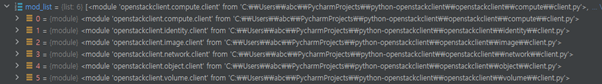

2week - openstack server list 명령어 동작 원리 파악
==========================================================

.. toctree::

Main 함수에서 사용자가 입력한 argv를 저장된 리스트를 OpenStackShell().run(argv)로 리턴하면서 시작합니다.

.. code-block:: python

	def main(argv=None):
		if argv is None:
			argv = sys.argv[1:]

	return OpenStackShell().run(argv)

이어서 OpenStackShell()의 init 함수를 시작합니다.

.. code-block:: python

	class OpenStackShell(shell.OpenStackShell):
		def __init__(self):
			super(OpenStackShell, self).__init__(
				description=__doc__.strip(),
				version=openstackclient.__version__,
				command_manager=commandmanager.CommandManager('openstack.cli'),
				deferred_help=True)

CommandManager의 init 함수를 시작합니다.

.. code-block:: python

    def __init__(self, namespace, convert_underscores=True):
        ...
        self._load_commands()

namepace는 openstack.cli고 정의가 되있으므로 load_commands를 호출합니다.

.. code-block:: python

    def _load_commands(self):
        if self.namespace:
            self.load_commands(self.namespace)
	
stevedore는 python
에서 런타임에 코드를 동적 로딩하기 위한 도구입니다.

.. code-block:: python
		

    def load_commands(self, namespace):
        self.group_list.append(namespace)
        for ep in stevedore.ExtensionManager(namespace):
            ...

ExtensionManager init 함수에서 _load_plugins 함수를 호출합니다.

.. code-block:: python

	class ExtensionManager(object):
		def __init__(self, namespace,
					 ...
					 verify_requirements=False):
			...
			extensions = self._load_plugins(invoke_on_load,
								invoke_args,
								invoke_kwds,
								verify_requirements)

이어서 list_entry_points 함수를 호출합니다.

.. code-block:: python

	def _load_plugins(self, invoke_on_load, invoke_args, invoke_kwds,
						verify_requirements):
		extensions = []
		for ep in self.list_entry_points():
			

계속 들어가 보겠습니다! 다음은 get_group_all 입니다!

.. code-block:: python

    def list_entry_points(self):

        if self.namespace not in self.ENTRY_POINT_CACHE:
            eps = list(_cache.get_group_all(self.namespace))
			...

거의 다 왔습니다. 마지막으로 _get_data_for_path 함수입니다.

.. code-block:: python

    def get_group_all(self, group, path=None):
        result = []
        data = self._get_data_for_path(path)
		...

중요하다고 생각한 함수라서 끊어서 확인하겠습니다.
여기서 sys.path를 가져오는데 sys.path는 파이썬 라이브러리가 들어있는 경로들을 반환합니다.

.. code-block:: python

    def _get_data_for_path(self, path):
        if path is None:
            path = sys.path
		...
        digest, path_values = _hash_settings_for_path(path)
        filename = os.path.join(self._dir, digest)
    
다음은 _hash_settings_for_path 함수입니다.
여기서 mtime은 파일의 수정된 날짜를 리턴합니다.
수정된 날짜를 계속 추가하면서(update) 해싱된 문자열(hexdigest)를 리턴합니다.
뭐하는 함수인가 생각해봤는데 파일의 무결성을 검증해주는 함수라고 생각했습니다.
실제로 C:\\Users\\사용자이름\\AppData\\Local\\python Entry Points\\ 에 파일이 저장됩니다.

.. code-block:: python

	paths = []
	h = hashlib.sha256()

	h.update(sys.executable.encode('utf-8'))
	h.update(sys.prefix.encode('utf-8'))

	for entry in path:
        mtime = _get_mtime(entry)
        h.update(entry.encode('utf-8'))
        h.update(_ftobytes(mtime))
        paths.append((entry, mtime))

        ...
            mtime = _get_mtime(ep_file)
            h.update(ep_file.encode('utf-8'))
            h.update(_ftobytes(mtime))
            paths.append((ep_file, mtime))

	return (h.hexdigest(), paths)

file을 따로 저장하지 않았기 때문에 IOError가 발생하고 except로 넘어가서 _build_cacheable_data 함수를 실행합니다.
path에는 sys.path 내용이 들어있습니다.

.. code-block:: python

        try:
            log.debug('reading %s', filename)
            with open(filename, 'r') as f:
                data = json.load(f)
        except (IOError, json.JSONDecodeError):
            data = _build_cacheable_data(path)

이어서 entry_points함수를 실행합니다.

.. code-block:: python

	def _build_cacheable_data(path):
		real_groups = importlib_metadata.entry_points()

여기서부터는 복잡해서 결과만 확인했습니다..

.. code-block:: python

	def entry_points(**params) -> Union[EntryPoints, SelectableGroups]:
		norm_name = operator.attrgetter('_normalized_name')
		unique = functools.partial(unique_everseen, key=norm_name)
		eps = itertools.chain.from_iterable(
			dist.entry_points for dist in unique(distributions())
		)
		return SelectableGroups.load(eps).select(**params)

리턴할 때 load함수를 호출하는데 load함수를 실행시키면 

.. code-block:: python

    @classmethod
    def load(cls, eps):
        by_group = operator.attrgetter('group')
        ordered = sorted(eps, key=by_group)
        grouped = itertools.groupby(ordered, by_group)
        return cls((group, EntryPoints(eps)) for group, eps in grouped)

.. image:: ../images/server_list_1.png
	:height: 161
	:width: 602
	:alt: ordered

이미지와같이 EntryPoint 객체가 저장되는데 name, value, group를 가져옵니다.
근데 이런 값들은 어디서 가져올 수 밖에 없어서 찾아보니,

.. code-block:: python

	[cliff.demo]
	error = cliffdemo.simple:Error
	file = cliffdemo.show:File
	files = cliffdemo.list:Files
	hooked = cliffdemo.hook:Hooked
	list files = cliffdemo.list:Files
	show file = cliffdemo.show:File
	simple = cliffdemo.simple:Simple
	two_part = cliffdemo.simple:Simple
	unicode = cliffdemo.encoding:Encoding

entry_points라는 텍스트 파일에서 관리하고 있었습니다.
group은 []안에 있는 cliff.demo, name은 = error, value는 cliffdemo.simple:Error가 됩니다.

**여기까지 하고나서 디버깅 다시 해봤다가 다른 점을 발견했습니다.**

위에서 확인했던 함수들은 계속 bp를 걸고 있었는데 main에서 OpenStackShell().run(argv)보다 먼저 실행하는 부분이 있었습니다.

바로 여기였습니다.

.. code-block:: python

	from openstackclient.common import clientmanager

get_plugin_modules함수를 통해 openstack.cli.base와 openstack.cli.extension을 인자로 각각 실행합니다.

.. code-block:: python

	# Get list of base plugin modules
	PLUGIN_MODULES = get_plugin_modules(
		'openstack.cli.base',
	)
	# Append list of external plugin modules
	PLUGIN_MODULES.extend(get_plugin_modules(
		'openstack.cli.extension',
	))

이 함수에서 stevedore를 다시 볼 수 있었습니다.

.. code-block:: python

	def get_plugin_modules(group):
		"""Find plugin entry points"""
		mod_list = []
		mgr = stevedore.ExtensionManager(group)
		...
	
위에서 봤던 _load_plugins, list_entry_points, get_group_all함수를 거치고 가면,

.. code-block:: python

    def get_group_all(self, group, path=None):
        result = []
        data = self._get_data_for_path(path)
        group_data = data.get('groups', {}).get(group, [])
        for vals in group_data:
            result.append(importlib_metadata.EntryPoint(*vals))
        return result

result에는 아래 내용을 entrypoints 객체로 반환합니다.
그리고 result에 추가합니다.

.. code-block:: python

	openstack.cli.base =
		compute = openstackclient.compute.client
		identity = openstackclient.identity.client
		image = openstackclient.image.client
		network = openstackclient.network.client
		object_store = openstackclient.object.client
		volume = openstackclient.volume.client

이 값을 가지고 mod_list 리스트를 만들어냅니다.

	
openstack.cli.extension도 확인하지만 값이 없어서 그대로 리턴합니다.

**그리고 이제 main 함수를 실행합니다.**

위의 과정을 생각하고 여기서부터 다시 이어서 보겠습니다.
_get_data_for_path에서 sys.path 경로에 모든 플러그인을 가져와서 그룹화합니다.
우리는 openstack.cli를 보기 때문에 result에는 openstack.cli를 그룹 이름으로 가진 값들이 나옵니다.

.. code-block:: python

    def get_group_all(self, group, path=None):
        result = []
        data = self._get_data_for_path(path)
        group_data = data.get('groups', {}).get(group, [])
        for vals in group_data:
            result.append(importlib_metadata.EntryPoint(*vals))
        return result

load_commands 함수 나머지 부분을 진행하면 _를 공백으로 바꾼 다음 commands에 등록합니다.

.. code-block:: python

    def load_commands(self, namespace):
        """Load all the commands from an entrypoint"""
        self.group_list.append(namespace)
        for ep in stevedore.ExtensionManager(namespace):
            LOG.debug('found command %r', ep.name)
            cmd_name = (ep.name.replace('_', ' ')
                        if self.convert_underscores
                        else ep.name)
            self.commands[cmd_name] = ep.entry_point
        return

그 다음으로 또 다른 stevedore를 만나게 됩니다. ExtensionManager() -> _load_plugins() -> list_entry_points()를 거치고 나면
keystoneauth1.plugin들을 추가하게됩니다.

.. code-block:: python

	def get_available_plugin_names():
		mgr = stevedore.EnabledExtensionManager(namespace=PLUGIN_NAMESPACE,
								check_func=_auth_plugin_available,
								invoke_on_load=True,
								propagate_map_exceptions=True)

한 번 더 만납니다! 여기서도 keystoneauth1.plugin인데 위와 차이점은 잘 모르겠습니다..

.. code-block:: python

	def get_plugin_loader(name):
		try:
			mgr = stevedore.DriverManager(namespace=PLUGIN_NAMESPACE,
						invoke_on_load=True,
						name=name)
		except RuntimeError:
			raise exceptions.NoMatchingPlugin(name)

		return mgr.driver

이제 OpenStackShell()이 끝났습니다...
다음으로 run()으로 가보겠습니다! argv에는 ['server', 'list']가 저장됐습니다.

.. code-block:: python

    def run(self, argv):
        ret_val = 1
        self.command_options = argv
        try:
            ret_val = super(OpenStackShell, self).run(argv)
            return ret_val

openstackclient\shell.py에서

.. code-block:: python

	def run(self, argv):
		...
		try:
			...
			self.initialize_app(remainder)

osc_lib\shell.py로 넘어왔습니다.

.. code-block:: python

	def initialize_app(self, argv):
	    self._load_plugins()

        self._load_commands()

PLUGIN_MODULES는 아까 OpenStackShell()보다 먼저 실행하는 부분이 있다고 했었습니다.
openstack.cli를 가져왔던 부분입니다.
C:\\Users\\abc\\PycharmProjects\\python-openstackclient\\openstackclient\\compute\\client.py에서
DEFAULT_API_VERSION을 정의했습니다. 

.. code-block:: python

    def _load_plugins(self):
        for mod in clientmanager.PLUGIN_MODULES:
            default_version = getattr(mod, 'DEFAULT_API_VERSION', None)
            option = mod.API_VERSION_OPTION.replace('os_', '', 1)
            version_opt = str(self.cloud.config.get(option, default_version))
			...
			version = '.v' + version_opt.replace('.', '_').split('_')[0]
            cmd_group = 'openstack.' + api.replace('-', '_') + version

위에서 cmd_group에는 openstack.compute.v2이 저장됩니다. 이 값을 가지고 load_commands를 호출합니다.
ExtensionManager에서 _load_plugins -> list_entry_points 과정을 또 거치면서 EntryPoint를 가져옵니다.
그리고 command를 등록합니다. 이 과정은 위의 load_plugins과 이어져서
'openstack.compute.v2' 뿐만 아니라 'openstack.identity.v3', 'openstack.image.v2', 'openstack.network.v2', 'openstack.object_store.v1', 'openstack.volume.v3',도 진행합니다.

.. code-block:: python

    def load_commands(self, namespace):
        self.group_list.append(namespace)
        for ep in stevedore.ExtensionManager(namespace):
            LOG.debug('found command %r', ep.name)
            cmd_name = (ep.name.replace('_', ' ')
                        if self.convert_underscores
                        else ep.name)
            self.commands[cmd_name] = ep.entry_point
        return

이제 osc_lib\shell.py의 OpenStackShell()이 끝났습니다!
run 함수로 가보겠습니다.

.. code-block:: python

	def run(self, argv):
		try:
			result = self.run_subcommand(remainder)
	
osc_lib\shell.py의 run_subcommand에서 

.. code-block:: python
	
    def run_subcommand(self, argv):
        self.init_profile()
        try:
            ret_value = super(OpenStackShell, self).run_subcommand(argv)

cliff\app.py의 run_subcommand로 넘어갑니다.
여기서 find_command 함수를 호출합니다.

.. code-block:: python

    def run_subcommand(self, argv):
        try:
            subcommand = self.command_manager.find_command(argv)
			
여기서 입력한 명령어가 commands에 있는지를 확인합니다.

.. code-block:: python

	def find_command(self, argv):
		start = self._get_last_possible_command_index(argv)
		for i in range(start, 0, -1):
			name = ' '.join(argv[:i])
			search_args = argv[i:]

			return_name = name
			if name in self._legacy:
				name = self._legacy[name]

			found = None
			if name in self.commands:
				found = name	

인자를 server list22라고 줬을 때, find_command 함수에서 value error를 반환하고
run_subcommand에서 error처리를 합니다. server list를 여기서 처리한다는 걸 알 수 있습니다.

.. code-block:: python

    def run_subcommand(self, argv):
        ...
        except ValueError as err:
            # If there was no exact match, try to find a fuzzy match
            the_cmd = argv[0]
            fuzzy_matches = self.get_fuzzy_matches(the_cmd)
            if fuzzy_matches:
                article = 'a'
                if self.NAME[0] in 'aeiou':
                    article = 'an'
                self.stdout.write('%s: \'%s\' is not %s %s command. '
                                  'See \'%s --help\'.\n'
                                  % (self.NAME, ' '.join(argv), article,
                                      self.NAME, self.NAME))
                self.stdout.write('Did you mean one of these?\n')
                for match in fuzzy_matches:
                    self.stdout.write('  %s\n' % match)

.. image:: ../images/server_list_3.png
	:height: 131
	:width: 602
	:alt: server_list_error

	
cliff\app.py의 run_subcommand에서
find_command 함수를 호출하고 나면, cmd.run함수를 볼 수 있습니다.

.. code-block:: python

	def run_subcommand(self, argv):
		try:
			subcommand = self.command_manager.find_command(argv)
		...
		result = cmd.run(parsed_args)

cliff\display.py의 run 함수로 넘어갑니다.

.. code-block:: python

    def run(self, parsed_args):
        self.log.debug('run(%s)', parsed_args)
        return super(Command, self).run(parsed_args)

끝이 보이고 있습니다. 메인 작업을 하는 take_action함수를 보겠습니다.

.. code-block:: python

    def run(self, parsed_args):
        parsed_args = self._run_before_hooks(parsed_args)
        self.formatter = self._formatter_plugins[parsed_args.formatter].obj
        column_names, data = self.take_action(parsed_args)
        ...

.. code-block:: python

	def take_action(self, parsed_args):
		data = compute_client.servers.list(search_opts=search_opts,
                                           marker=marker_id,
                                           limit=parsed_args.limit)

list 함수를 타고 타고 넘어가다보면..
list -> _list -> get -> request -> request -> request -> request 로 가면 아래와 같은 함수가 있습니다.

.. code-block:: python

	def request(self, url, method, json=None, original_ip=None,
				user_agent=None, redirect=None, authenticated=None,
				endpoint_filter=None, auth=None, requests_auth=None,
				raise_exc=True, allow_reauth=True, log=True,
				endpoint_override=None, connect_retries=None, logger=None,
				allow=None, client_name=None, client_version=None,
				microversion=None, microversion_service_type=None,
				status_code_retries=0, retriable_status_codes=None,
				rate_semaphore=None, global_request_id=None,
				connect_retry_delay=None, status_code_retry_delay=None,
				**kwargs):
		if not urllib.parse.urlparse(url).netloc:
			base_url = None

			if endpoint_override:
				base_url = endpoint_override % _StringFormatter(self, auth)
			elif endpoint_filter:
				base_url = self.get_endpoint(auth, allow=allow,
											**endpoint_filter)

            if not base_url:
                raise exceptions.EndpointNotFound()

            url = '%s/%s' % (base_url.rstrip('/'), url.lstrip('/'))
		...
		resp = send(**kwargs)
		
		
auth와 endpoint_filter를 사용해서 base_url = http://211.37.148.106/compute/v2.1/을 만듭니다.
그리고, url = /servers/detail을 조합해서
최종 url = http://211.37.148.106/compute/v2.1/servers/detail/을 만듭니다.

마지막 send 함수를 통해 api를 호출합니다.

그리고 이 과정은 server/detail 뿐만 아니라 image/detail, flavors/detail도 확인합니다. 

마지막으로 produce_output 함수를 보겠습니다.

.. code-block:: python

    def run(self, parsed_args):
        parsed_args = self._run_before_hooks(parsed_args)
        self.formatter = self._formatter_plugins[parsed_args.formatter].obj
        column_names, data = self.take_action(parsed_args)
        column_names, data = self._run_after_hooks(parsed_args,
                                                   (column_names, data))
        self.produce_output(parsed_args, column_names, data)
        return 0

column_names에 ID, Name, Status, Networks, Image, Flavor 값들이 들어가고
add_rows 함수에서 data를 입력합니다.
마지막으로 x 에 있는 값을 문자열로 바꿔준 다음, stdout.write 함수를 통해 출력합니다.

.. code-block:: python

        x = prettytable.PrettyTable(
            column_names,
            print_empty=parsed_args.print_empty,
        )
		x.padding_width = 1

        # Add rows if data is provided
        if data:
            self.add_rows(x, column_names, data)
		...
		formatted = x.get_string()
        stdout.write(formatted)
        stdout.write('\n')
        return

문제 1) 인자로 입력받은 server list를 어떻게 구별해내는가?
----------------------------------------------------------------------
- find_command에서 실제 있는 명령어인지 구별합니다.

문제 2) server list라는 명령어를 처리하는 파일은 무엇인가?
----------------------------------------------------------------------
- cmd.run(parsed_args)에서 실행합니다.

문제 3) openstackcli는 어떻게 nova api 주소를 알아내나요?
----------------------------------------------------------------------
- auth와 endpoint_filter를 사용해서 base_url = http://211.37.148.106/compute/v2.1/을 만듭니다.

문제 4) Nova의 어떤 api를 호출하여 결과를 받아오나요? (어떤 uri를 호출하나요?)
------------------------------------------------------------------------------------------------------
- url에 들어있는 /servers/detail 값을 사용해서 url = http://211.37.148.106/compute/v2.1/servers/detail/을 만듭니다.

문제 5) 결과를 이쁘게 table 형식으로 출력해주는 함수는 무엇일까요?
----------------------------------------------------------------------
- PrettyTable 함수에서 만들어줍니다.