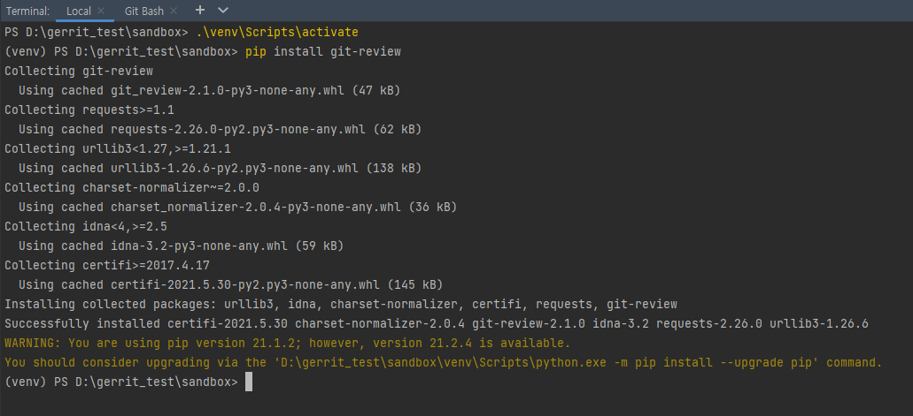
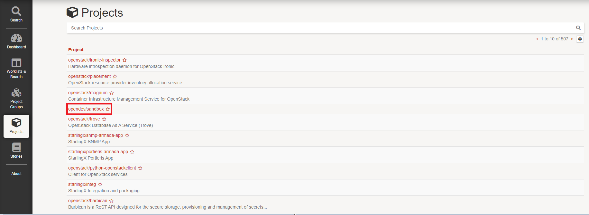
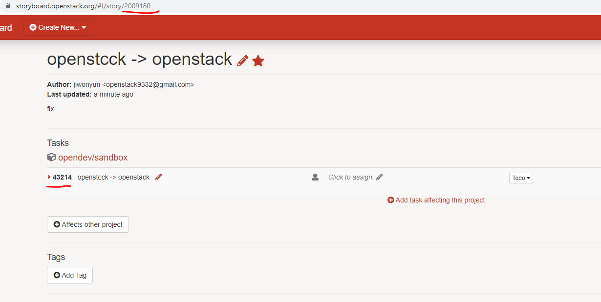
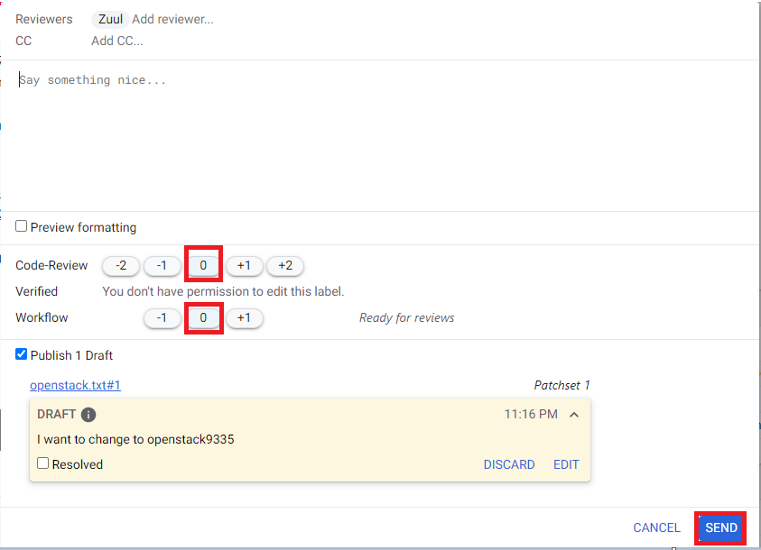

Gerrit 초기 설정
==========================================================

1. sandbox 테스트 환경 구성하기 ( Windows 10 )
**********************************************************************

기본 설정 ( PyCharm )
-----------------------------------------------------------------------

opendev/sandbox download

.. image:: images/1_sendbox_homepage.png

Pycharm에서 Sandbox 테스트 환경 구성

.. image:: images/2_git_add.png

현재 원격 저장소 확인

.. image:: images/3_sandbox_remote_v.png

ssh 키 생성

.. image:: images/4_git_ssh-keygen_add.png

ssh 키 확인

.. image:: images/5_see_key.png

config 파일 설정

.. image:: images/6_config.png

기본 설정 ( Gerrit )
-----------------------------------------------------------------------

gerrit 로그인 후 profile에서 username 설정한다

**주의 - 한 번 설정된 username은 변경하지 못한다**

.. image:: images/7_username_setting.png

Agreements 설정

.. image:: images/8_Agreements.png

.. image:: images/9_ICAL_ADD.png

SSH Key 추가하기

만들었던 ssh key - id_rsa.pub 의 정보를 추가한다

.. image:: images/10_public_add.png

기본 설정 ( PyCharm )
-----------------------------------------------------------------------

다음과 같이 gerrit의 username을 설정해준다.

.. image:: images/11_config_setting.png

git review를 설치하기 위해 자신의 python interface를 사용한다.

git review -s 명령어를 실행한 후 원격 remote 정보를 확인

.. image:: images/13_git_review.png

Pycharm에서 vi 기능이 잘 안 될 경우
-----------------------------------------------------------------------

다운로드 받은 Sandbox 의 Git Bash 로 vi 사용 시, 개인적으로 vi 사용 후 ESC 키가 먹히지 않았다.

vi yes.py 후 ESC 키가 안 먹는 모습

.. image:: images/14_git_bug.png

따라서 직접 git bash를 실행하여 진행하였다. ( 없을 경우 다운로드 )

.. image:: images/15_git_bash_cmd.png

다운로드 받은 sandbox 폴더로 이동

.. image:: images/16_cd_sandbox.png

python interface 사용

.. image:: images/17_git_cmd.png

이제 vi yes.py 후 ESC 키가 정상적으로 사용되어 저장이 된다.

.. image:: images/18_esc.png

Pycharm에서 UTF-8 관련 인코딩 에러 발생 시
-----------------------------------------------------------------------

https://stackoverflow.com/questions/50933194/how-do-i-set-the-pythonutf8-environment-variable-to-enable-utf-8-encoding-by-def

set PYTHONUTF8=1  # windows

2. gerrit으로 commit 하기
**********************************************************************

( 실습 )

openstack9332@gmail.com  - username : HelloJiwonStack - ( 컨트리뷰터: 오픈소스 기여자 )

openstack9335@gmail.com  - username : jiwonyun - ( 커미터: 소스 코드를 수정하고 조절할 수 있는 권한을 가진 사람 )

1. 컨트리뷰터가 오타를 발견하고 수정 후 커밋 요청
-----------------------------------------------------------------------

HelloJiwonStack 은 opendev/sandbox 의 소스코드 중 openstack.txt 파일의 내용 openstcck 의 오타를 발견하였다.

.. image:: images/19_openacc_fix.png

따라서 다음과 같이 openstack 으로 오타 수정하였다.

.. image:: images/20_fix.png

gerrit 이용할 것이기 때문에 아래 처럼 커밋을 하기 전에

.. image:: images/21_commit.png

storyboard 에 접속 -> project -> opendev/sandbox 누른 후

다음과 같이 스토리를 추가한다.

.. image:: images/23_sandbox_add.png

URL에 있는 story 번호와 아래의 task 번호를 기억한다.

방금 git commit 하면서 나온 화면에서 storyboard/task 넘버를 아래처럼 기재한다.

.. image:: images/25_write.png

git review 하면 gerrit URL 가 생성된다.

.. image:: images/26_gerrit.png

접속하여 확인해보면 수정한 코드 부분을 볼 수 있다.

.. image:: images/27_gerrit.png

2. 커미터가 요청 확인 후 피드백
-----------------------------------------------------------------------

피드백 메시지를 남긴 후 up 버튼을 누른다.

.. image:: images/28_gerrit.png

REPLY 한다.

.. image:: images/29_gerrit.png

이때 점수는 아직 0 0 으로 부여한다.

3. 컨트리뷰터가 피드백을 확인하고 다시 커밋하는 과정
-----------------------------------------------------------------------

컨트리뷰터가 피드백을 확인하는 모습

.. image:: images/31_gerrit.png

따라서 openstack.txt 파일을 openstack9335 로 수정한 후

git add openstack.txt 한 후 올린 commit 을 수정할 때는

git commit - -amend 명령어를 사용한다.

.. image:: images/32_gerrit.png

그 후 git review 하면 피드백을 통한 커밋 수정을 완료하였다.

.. image:: images/33_gerrit.png

4. 커미터가 컨트리뷰터가 수정하여 다시 커밋한 Patchset 2 를 확인하고 점수 부여하는 과정
------------------------------------------------------------------------------------------

patchset 2 확인

.. image:: images/34_gerrit.png

점수 부여

.. image:: images/35_end.png

.. image:: images/36_end2.png

Code-Review 점수 2점과 Workflow 점수 1점을 받으면서 해당 gerrit 과 storyboard는 종료된다.

opendev/sandbox 에서 오픈소스 코드가 변경된 것을 확인할 수 있다.

.. image:: images/37_end3.png
