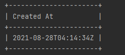

openstack sever list 기능 추가하기
==========================================================

이번주 과제는 openstack 의 server list 기능을 확장 시키는 것이였습니다.
우리는 server list 명령어를 입력할 때 6개의 항목만 볼 수 있었는데 여기에 
“Project ID”, “Created at” 이라는 항목도 추가적으로 볼 수 있게 구현하는게 목표입니다!

1. 어느 부분을 수정해야 할까?
____________________________________________________________________ 

우선적으로 저는 server list 라는 명령어를 처리하는 python-openstackclient/openstackclient/compute/v2/server.py 부분과 출력을 담당하는 
python-openstackclient/venv/lib/site-packages/cliff-3.8.0-py3.9.egg/cliff/lister.py 를 살펴보고자 했습니다.

2. column header 변수 따라가기
____________________________________________________________________
우선적으로 server list 명령어를 수행하면 우리는 ID, Flavor, image 등 속성을 나타내는 단어를 볼 수 있습니다. 
그래서 이 단어들을 추적하기로 했습니다. 지난 과제처럼 계속 함수를 따라가다가 `sever.py <https://github.com/openstack/python-openstackclient/blob/86bca18b74539d024e3854af0dfd3552c4d3b50b/openstackclient/compute/v2/server.py#L2315>`_
파일에 column header 에 ID,Flavor 와 같은 속성들이 담긴다는 것을 알 수 있었습니다. 

 .. code-block::

    else:
                columns = (
                    'ID',
                    'Name',
                    'Status',
                    'Networks',
                    'Image Name',
                    'Flavor Name',
                )
            column_headers = (
                'ID',
                'Name',
                'Status',
                'Networks',
                'Image',
                'Flavor',
            )

3. column header 의 값과 매칭되는 data를 찾아오는 방법
____________________________________________________________________
column header를 찾고나서 드는 의문점은 api를 호출할 때, 항목에 있는 6가지 값만을 받아오는지, 전체 데이터를 받아온 후 거기서 6개의 데이터를 매칭해서 출력하는지 의문점이 들었습니다.
즉, 전체에서 6개를 찾아서 가져오는지, 전체를 가져오고 거기서 6개를 찾아오는 방식인지에 대한 궁금증이 생겼습니다. 
정답은 전체를 가져오는 것으로 보입니다. 우리가 실질적으로 api를 호출하고 그 값을 받아오는 adapter.py 의 body 변수를 보면 6개의 항목뿐만아니라  
instance에 대한 모든 정보를 가져옴을 확인 할 수 있었기 때문입니다.

.. image:: ../images/week3-1_0.png
    :height: 500
    :width: 700
    :alt: body정보

4. “Project ID”, “Created at” 항목 추가하기
____________________________________________________________________
전체 값이 저장되어있음을 알았으니 이제 원하는 항목들만 출력하는 것을 알게 되었습니다. 앞서 언급한대로 server.py의 column_header에 
Project ID 와 Creatd at을 넣어주면 어느 함수에서 이 항목들을 추가적으로 매칭해서 출력해줄거라고 생각했습니다. 
그러면 어떤 이름으로 column_header를 추가해줄지 의문점이 생길 것입니다. 이는 바로 column_header 정보 아래 코드를 보면 정답이 나와있습니다. 

.. code-block::

    for c in parsed_args.columns:
                if c in ('Project ID', 'project_id'):
                    columns.append('tenant_id')
                    column_headers.append('Project ID')
                if c in ('User ID', 'user_id'):
                    columns.append('user_id')
                    column_headers.append('User ID')
                if c in ('Created At', 'created_at'):
                    columns.append('created_at')
                    column_headers.append('Created At')

이 함수들은 openstack server list –c “원하는 칼럼”을 입력했을 때 –c “원하는 칼럼” 부분을 해결해주는 함수입니다. 
어떻게 원하는 칼럼을 출력해주는지 보면 column_header 와 column 에 append 함수를 이용하여 값을 넣어줌으로서 원하는 칼럼을 출력하고 있습니다. 
여기서 저는 column_header에 미리 appned 될 값을 넣어두면 –c 명령어 없이도 바로 해당 칼럼도 출력해주지 않을까 하는 방향을 생각하게 되었습니다.

5. 기능 추가 및 발생했던 오류
____________________________________________________________________
앞서 생각한 아이디어를 토대로 column_header 에 created_at, tenant_id를 추가해주었습니다. 
그리고 출력에서 나타나는 형식인 column에는 Created At, Projct ID 이라고 추가해주었습니다. 
이제 결과 값을 확인했습니다. 그런데 Project ID는 성공했는데 Created At은 빈 테이블이 출력됩니다. 
혹시 몰라서 openstack server list –c “Created At” 명령어를 사용해보았으나, 역시나 빈 테이블이 출력되었습니다. 
그래서 그 이유를 찾아보고자 Nova API에서 받은 Return 값을 살펴보았습니다. return 값은 분명 created 로 값이 저장되어있는데 
우리는 created_at 이라는 항목으로 해당 값을 찾고 있었습니다. 따라서 column header에서 created_at을 created로 변경하니 원하는 출력값을 얻을 수 있었습니다. 

 * created_at 빈 테이블 출력 문제

.. image:: ../images/week3-1_1.png
    :height: 200
    :width: 700
    :alt: created_at오류

.. code-block::

    else:
                columns = (
                    'ID',
                    'Name',
                    'Status',
                    'Networks',
                    'Image Name',
                    'Flavor Name',
                    'created',
                    'tenant_id',
                )
            column_headers = (
                'ID',
                'Name',
                'Status',
                'Networks',
                'Image',
                'Flavor',
                'Created At',
                'Project ID',
            )

.. image:: ../images/week3-1_2.png
    :height: 200
    :width: 700

* created 수정 후에는 이와 같이 원하는 출력이 나옵니다.

6. openstack PR 올리기
____________________________________________________________________
5번에서 openstack server list –c “Created At”에서 해당 함수가 실행 되고나면 created_at이 아닌 
created 가 추가 되어야 제 기능을 한다는 것을 알게 되었습니다. 즉, 현재의 명령어에 버그를 발견한 것입니다.

.. code-block::

    for c in parsed_args.columns:
                if c in ('Project ID', 'project_id'):
                    columns.append('tenant_id')
                    column_headers.append('Project ID')
                if c in ('User ID', 'user_id'):
                    columns.append('user_id')
                    column_headers.append('User ID')
                if c in ('Created At', 'created_at'):
                    columns.append('created_at') // 이 부분이 created_at 이 아닌 created로 들어가야 제대로 된 동작 가능
                    column_headers.append('Created At')

.. image:: ../images/week3-1_3.png
    :height: 200
    :width: 300

멘토님과 멘티인 승태님의 도움을 받아 해당 부분을 created 로 바꾸어야한다는 PR을 올리고 openstack에 첫 기여를 하게 되었습니다. 아래는 PR 내용과 Stroy에 해당 버그에 대해 알린 내용입니다.
https://review.opendev.org/c/openstack/python-openstackclient/+/806464