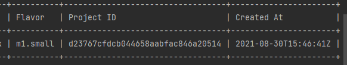

==========================================================
3주차 - openstack server list에 field 추가하기
==========================================================

문제 1) openstack server list의 기본 결과 필드에 "Project ID"를 추가하기
--------------------------------------------------------------------------------------------------------------------

문제 2) openstack server list의 기본 결과 필드에 "Created At"을 추가하기
--------------------------------------------------------------------------------------------------------------------

지금까지 과제를 하면서 아래 과정에서 column_names, data를 PrettyTable에 추가해서 출력한다는 걸 알았습니다.

.. code-block:: python

	def emit_list(self, column_names, data, stdout, parsed_args):
		x = prettytable.PrettyTable(
			column_names,
			print_empty=parsed_args.print_empty,
		)
		x.padding_width = 1

		# Add rows if data is provided
		if data:
			self.add_rows(x, column_names, data)

이 column_names는 display.py의 run 함수에서 take_action 함수를 실행한 결과입니다.

.. code-block:: python

	def run(self, parsed_args):
		parsed_args = self._run_before_hooks(parsed_args)
		self.formatter = self._formatter_plugins[parsed_args.formatter].obj
		column_names, data = self.take_action(parsed_args)
		column_names, data = self._run_after_hooks(parsed_args,
						(column_names, data))
		self.produce_output(parsed_args, column_names, data)

take_action 함수로 들어가면 column_header와 columns가 else 과정에서 정해지는 걸 확인할 수 있습니다.

.. code-block:: python

	if parsed_args.no_name_lookup:
		columns = (
			'ID',
			'Name',
			'Status',
			'Networks',
			'Image ID',
			'Flavor ID',
		)
	else:
		columns = (
			'ID',
			'Name',
			'Status',
			'Networks',
			'Image Name',
			'Flavor Name'
		)
		column_headers = (
			'ID',
			'Name',
			'Status',
			'Networks',
			'Image',
			'Flavor'
		)

그리고 조금만 밑으로 내려가면 다음 과정을 볼 수 있습니다.
	
.. code-block:: python
	
	def take_action(self, parsed_args):
		...
		# Populate image_name, image_id, flavor_name and flavor_id attributes
		# of server objects so that we can display those columns.
		for s in data:
			if compute_client.api_version >= api_versions.APIVersion('2.69'):
				if not hasattr(s, 'image') or not hasattr(s, 'flavor'):
					continue
			if 'id' in s.image:
				image = images.get(s.image['id'])
				if image:
					s.image_name = image.name
				s.image_id = s.image['id']
			else:
				s.image_name = IMAGE_STRING_FOR_BFV
				s.image_id = IMAGE_STRING_FOR_BFV
			if 'id' in s.flavor:
				flavor = flavors.get(s.flavor['id'])
				if flavor:
					s.flavor_name = flavor.name
				s.flavor_id = s.flavor['id']
			else:
				s.flavor_name = ''
				s.flavor_id = ''

		table = (
			column_headers,
			(
				utils.get_item_properties(
					s, columns,
					mixed_case_fields=mixed_case_fields,
					formatters={
						'OS-EXT-STS:power_state': PowerStateColumn,
						'Networks': format_columns.DictListColumn,
						'Metadata': format_columns.DictColumn,
					},
				) for s in data
			),
		)
		return table
		
		
data에 있는 값을 하나씩 꺼내서 image_id, flavor_id를 추가해줍니다. 근데 flavor, image 말고도 network, id, status 등 값이 많은데 분명히 이 값을 넣어주는 함수가 있다고 생각했습니다.  
그리고 밑에 table 에서 값을 수정하고 table을 리턴하는데 Step Into(F7)를 해도 반응이 없습니다.
함수가 보이길래 get_item_properties 함수에 BP를 걸고 넘어가보겠습니다.

.. code-block:: python

		def add_rows(self, table, column_names, data):
			data_iter = iter(data)
			try:
				first_row = next(data_iter)

맨 처음에 봤던 emit_list 함수의 add_rows 함수에서 
first_row = next(data_iter)를 실행하게 되면,

.. code-block:: python
	
	def get_item_properties(item, fields, mixed_case_fields=None, formatters=None):

		if mixed_case_fields is None:
			mixed_case_fields = []
		if formatters is None:
			formatters = {}

		row = []

		for field in fields:
			if field in mixed_case_fields:
				field_name = field.replace(' ', '_')
			else:
				field_name = field.lower().replace(' ', '_')
			data = getattr(item, field_name, '')
			if field in formatters:
				formatter = formatters[field]
				if (isinstance(formatter, type) and issubclass(
						formatter, cliff_columns.FormattableColumn)):
					data = formatter(data)
				elif callable(formatter):
					warnings.warn(
						'The usage of formatter functions is now discouraged. '
						'Consider using cliff.columns.FormattableColumn instead. '
						'See reviews linked with bug 1687955 for more detail.',
						category=DeprecationWarning)
					if data is not None:
						data = formatter(data)
				else:
					msg = "Invalid formatter provided."
					raise exceptions.CommandError(msg)

			row.append(data)
		return tuple(row)

아까 BP를 걸었던 함수가 실행이 됩니다. 이 함수에서 fields는 아까 columns에 내용들입니다.
그리고 item에 해당 값이 있는지를 확인합니다.

.. image:: ../images/addfield_1.png
	:height: 221
	:width: 602
	:alt: flavor list
	
.. image:: ../images/addfield_2.png
	:height: 267
	:width: 602
	:alt: flavor list
	

값을 확인해보면 아까 flavor와 image의 name이나 id를 추가한 것도 여기서 출력하기 위해서였다는 걸 알 수 있었습니다.
item의 내용을 보고 created, tenant_id를 columns에 추가해보겠습니다.

.. code-block:: python

	columns = (
		'ID',
		'Name',
		'Status',
		'Networks',
		'Image Name',
		'Flavor Name',
		'Tenent ID',
		'Created'
	)
	column_headers = (
		'ID',
		'Name',
		'Status',
		'Networks',
		'Image',
		'Flavor',
		'Project ID',
		'Created At'
	)

어차피 lower() 함수로 들어가고 공백을 _로 바꾸기 때문에 잘 알아 볼 수 있으면 될 것 같습니다.

	
	
	
잘 출력되는 걸 확인 할 수 있습니다 :)