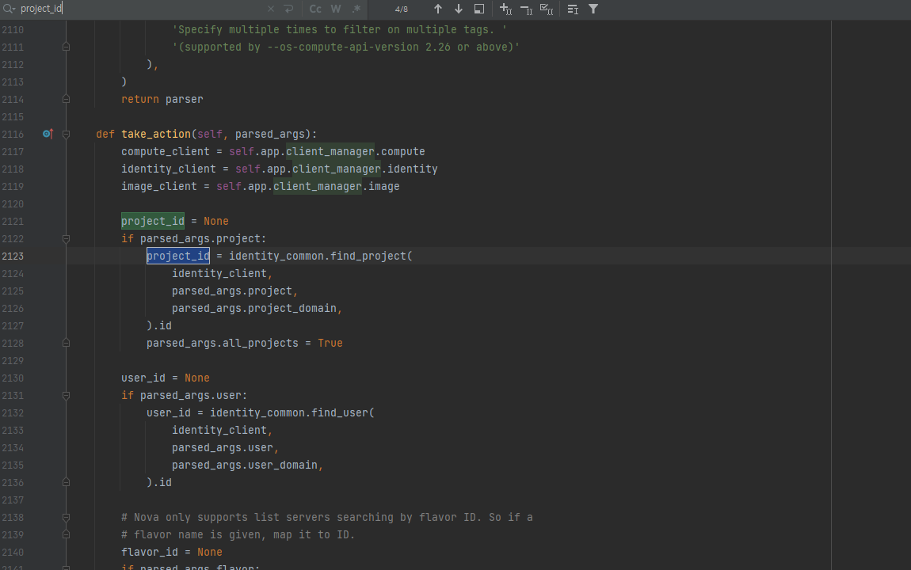
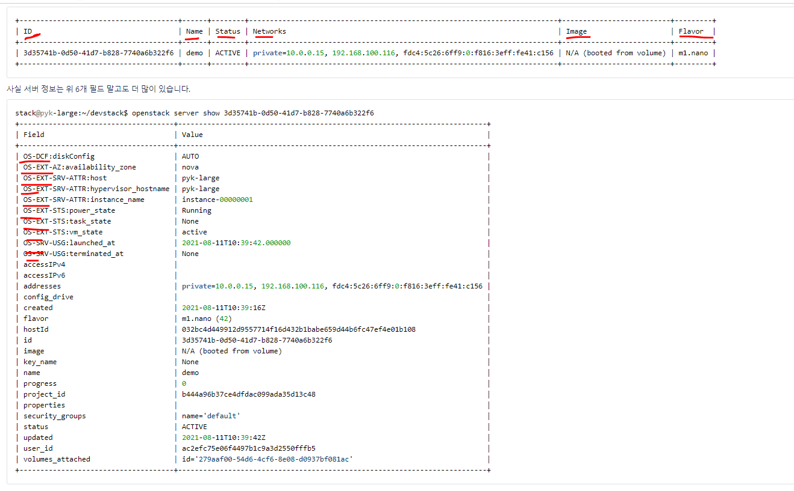
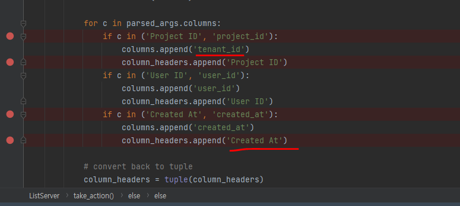

3주차 과제 - openstack server list 에 field 추가하기
==========================================================

미션 1: openstack server list 의 기본 결과 필드에 "Project ID" 를 추가하기
*********************************************************************************************************

**조사 로직**

 우선 Nova API를 처리하는 파일이 openstackclient -> compute -> v2 -> server.py의 ListServer 클래스이므로

1. 아래의 사진과 같이 openstack server list -h 하여 ListServer 을 조사해보았다
----------------------------------------------------------------------------------------------------------------------------------------

.. image:: images/picture_1.png

2. 다음으로 server.py 파일 내 project_id 를 검색해보았다.
----------------------------------------------------------------------------------------------------------------------------------------

3. 그러던 중 과제의 항목과 흡사한 내용을 볼 수 있었으며.
----------------------------------------------------------------------------------------------------------------------------------------

.. image:: images/picture_4.png

4. 디폴트로 표시되는 6가지 항목과 찾아야할 대상인 project_id 와 Created At 가 있었으므로 디버깅을 걸고 확인해보았다.
----------------------------------------------------------------------------------------------------------------------------------------

.. image:: images/picture_5.png

5. 다음과 같이 Project ID를 추가해 보았으나 헤더만 추가되었고 내용은 추가되지 않았다.
----------------------------------------------------------------------------------------------------------------------------------------

.. image:: images/picture_6.png

6. 아래의 그림을 통해 테스트하여 columns 의 Project ID가 틀렸다는 것을 알 수 있게 되었다.
------------------------------------------------------------------------------------------------------------------------------------------------------------------------

컬럼 헤더 테스트

.. image:: images/picture_7.png

컬럼 테스트

.. image:: images/picture_8.png

7. Project id 를 출력할 것으로 예상가능 tenant_id 를 추가하였더니 결과가 잘 나왔다. 또한 하는 김에 Create At도 추가하였다.
-----------------------------------------------------------------------------------------------------------------------------------------------------------------------------------

.. image:: images/picture_10.png

8. 하지만 Create_At는 출력되지 않았는데, 여기서 출력되는 Project_ID와 openstack server show id 를 통해 검증 작업을 하다
---------------------------------------------------------------------------------------------------------------------------------------------------------------------------------

.. image:: images/picture_11.png

미션2: openstack server list 의 기본 결과 필드에 "Created At"를 추가하기
****************************************************************************************

9. 만들어진 시간을 나타내는 필드 명칭이 created 인 것을 확인하여 변경해 주었더니 정상 출력되었습니다
-----------------------------------------------------------------------------------------------------------------

.. image:: images/picture_12.png
