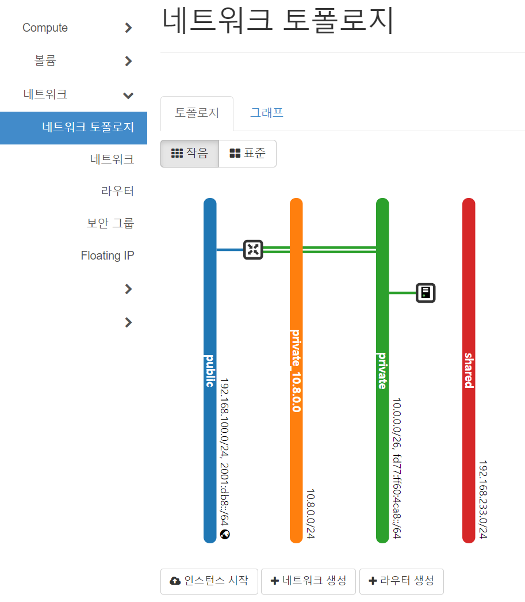
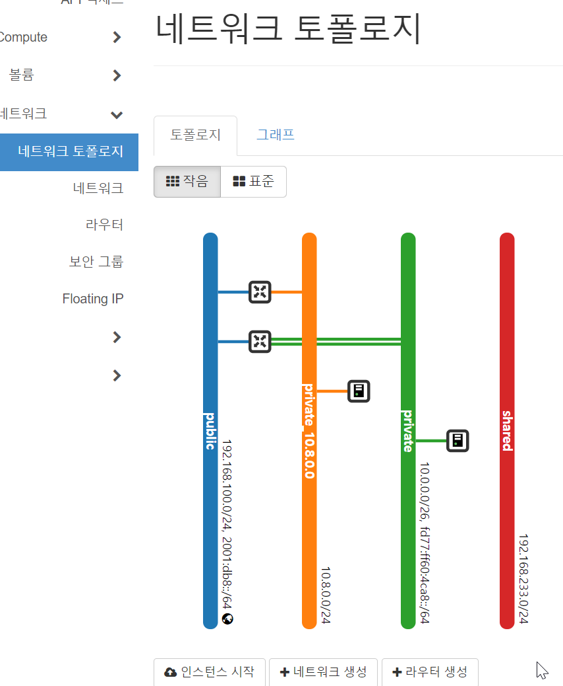
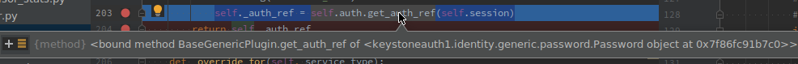

==========================
Homework in Week 2nd
==========================

--------
Homework
--------

1. CLI와 친해지기
    4가지 방법은 팀 블로그의 본인 이름 폴더에 과제 폴더를 만든 뒤, "2주차 과제 - CLI와 친해지기" 이라는 제목으로 PR을 올려주세요.

    1. cirros image로 인스턴스 생성을 cli로 해보기
        :code:`openstack server create` ← 기본 명령어 + 옵션
    2. ubuntu 이미지를 받고, root password를 설정한 다음 cli로 이미지 등록한 후 인스턴스 생성하고 접속까지 하기
    3. cli로 floating ip 생성 후 인스턴스에 할당, 해제 해보기
        ubuntu image: `focal-server-cloudimg-amd64.img <https://cloud-images.ubuntu.com/focal/current/focal-server-cloudimg-amd64.img>`_
        
        만약 root password 설정을 못하겠다면, 인스턴스 생성 후 로그인 창 까지만 떠도 OK
    4. 10.8.0.0/24 네트워크를 만들고 public network와 연결하는 과정을 cli로 해보기(optional)

2. openstack server list 명령어 동작 원리 파악
    openstack server list 는 환경변수에 등록된 프로젝트의 모든 인스턴스를 출력하는 명령어입니다. python-openstackcli 의 코드 내부에서 이 명령어를 처리하기 위한 절차를 분석 후 자유롭게 보고서로 작성해주세요.

    - 주요 분석 포인트
        - 인자로 입력받은 :code:`server list` 를 어떻게 구별해내는가?
        - :code:`server list` 라는 명령어를 처리하는 파일은 무엇인가?
        - openstackcli 는 어떻게 nova api 주소를 알아내나요?
        - nova 의 어떤 API를 호출하여 결과를 받아오나요? (어떤 URI 를 호출하나요?)
        - 결과를 이쁘게 table 형식으로 출력해주는 함수는 무엇일까요?

각자 분석한 내용은 팀 블로그의 본인 이름 폴더에 과제 폴더를 만든 뒤, "2주차 과제 - openstack server list 명령어 동작 원리 파악" 이라는 제목으로 PR을 올려주세요.

------------------------
Background Knowledge
------------------------

OpneStack CLI의 기본 구조와 인증
=====================================

OpenStack CLI의 명령어 기본 구조는 아래와 같다.

.. code-block:: bash

    openstack [<global-options>] <command> [<command-arguments>]
    openstack help <command>
    opentsack --help

OpenStack CLI를 사용하기 위해선 인증 과정을 거쳐야 하는데, keystoneclient library에서 제공하는 token, username/password, openid 인증 방식을 사용할 수 있다.

일부 기능의 경우 요구하는 인증 방식이 있어 참고가 핑료하다. 인증관련된 기본적인 테스트를 위해 현재 프로젝트 리스트를 가져오는 :code:`project list` 명령어를 실행해서 테스트를 해볼 수 있다.

.. code-block:: bash

    openstack \
    --os-user-domain-name default \
    --os-username admin \
    --os-password secret \
    --os-auth-url http://your.ip/identity \
    project list

    `--os-user-domain-name`에 들어갈 값과 `--os-auth-url`의 값은 `/etc/openstack/clouds.yaml` 파일을 참고하면 된다.

:code:`openstack` 명령어는 기본적으로 인증에 필요한 값들을 환경변수에서 먼저 읽어 사용하는데 devstack 소스 프로젝트의 :code:`./devstack/openrc`를 실행하면 별도 인증 관련 argument 없이 :code:`openstack` 명령어를 실행할 수 있는 환경변수를 모두 설정해준다. 아래와 같이 실행할 수 있다.

.. code-block:: bash

    source ./devstack/openrc admin default

devstack 소스 프로젝의의 :code:`./devstack/openrc` 파일을 실행해서 기본 인증

Glossary
=====================================

.. glossary::
    
    domain
      users, groups, projects가 포함되는 collection이다. group, project와 domain의 관계는 1:N 관계로 group, project는 하나의 domain에만 속할 수 있다.
    
    Project
      OpenStack에서 ownership의 기본 단위. OpenStack의 모든 리소스는 project에 속해야 하고 project는 domain에 속해야 한다.

    Image
      image, virtual machine image란 부팅가능한 os가 설치되어 있는 가상 디스크를 포함하고 있는 단일 파일을 의미한다. 이미지를 사용해서 클라우드상에서 가상머신의 인스턴스를 생성할 수 있다. :code:`openstack image list`

    Security Group
      네트워크 트래픽을 필터링하는 rule을 정한 집합이다. `openstack security group list`

    Cloud Image
      일반적인 os 이미지의 경우 언어 선택, 디스크 사이즈 선택, 네트워크 선택 등 다양한 요소들을 사용자가 설치하며 진행하게 된다. 하지만 이런 사용자와의 interaction은 클라우드 등 auto deploy 환경에서 걸림돌이 될 수 있다. 클라우드 이미지는 자동화된 시스템에 의해서 os가 자동으로 배포될 수 있도록 유저와의 interfaction을 없애고 os 설치에 필요한 값들을 미리 지정하고 디스크 사이즈 등의 필요한 요소들을 파라미터화, 자동화 해놓은 이미지이다.

1-1 CLI와 친해지기: cirros image로 인스턴스 생성을 cli로 해보기
===============================================================================================================

가상 머신을 생성하기 위한 CLI 명령어는 :code:`openstack server create` 명령어를 사용하면 되는데, 몇가지 argument를 필수로 입력해야 한다.

* flavor: 가상머신의 컴퓨팅 리소스(compute, memory, storage)의 preset이다. GUI 화면에서 인스턴스 생성 단계의 'Flavor'에 해당는 부분이다. :code:`flavor list` 명령어를 사용해서 id와 name을 확인할 수 있다.
    .. image:: images/2nd-week_server-create-flavor.png
        :width: 600
* image: 인스턴스 사용에 생성할 베이스 이미지. GUI 화면에서 인스턴스 생성 단계의 '소스'에 해당하는 부분이다. :code:`image list` 명령어를 사용해서 id와 name을 확인할 수 있다.
    .. image:: images/2nd-week_server-create-image.png
        :width: 600
* network : 인스턴스서서 사용할 네트워크. GUI 화면에서 인스턴스 생성 단계의 '네트워크'에 해당하는 부분이다. :code:`network list` 명령어를 사용해서 id와 name을 확인할 수 있다.
    .. image:: images/2nd-week_server-create-network.png
        :width: 600

위 정보를 취합해 아래 명령어를 완성할 수 있다.

.. code-block:: bash
    :linenos:

    openstack \
      server create \
      --flavor m1.nano \
      --image cirros-0.5.2-x86_64-disk \
      --network private \
      cirros-test    # 생성할 인스턴스의 이름

1-2 ubuntu 이미지를 받고, root password를 설정한 다음 cli로 이미지 등록한 후 인스턴스 생성하고 접속까지 하기
===============================================================================================================

ubuntu 클라우드 이미지 배포판을 다운로드받는다.

.. code-block:: bash
    :linenos:

    wget https://cloud-images.ubuntu.com/focal/current/focal-server-cloudimg-amd64.img

클라우드 이미지의 설정을 수정할 수 있는 :code:`virt-customize` 툴을 다운로드, 사용해서 이미지의 root 비밀번호를 변경한다.

.. code-block:: bash
    :linenos:

    apt-get install libguestfs-tools
    sudo virt-customize -a focal-server-cloudimg-amd64.img --root-password password:secret

이전 :code:`2-1` 과제에서 사용했던 :code:`server create` 명령어를 사용하기 전에 비밀번호를 변경했던 이미지 파일을 OpenStack에 등록하는 절차가 필요하다. 이미지 등록은 :code:`image create` 명령어를 사용해서 할 수 있고 현재 이미지 리스트는 :code:`image list` 명령어를 사용해 볼 수 있다.

.. code-block:: bash
    :linenos:
    
    openstack \
      image create \
      --file focal-server-cloudimg-amd64.img \      # 업로드 할 로컬 이미지 파일 path
      --public \           # 해당 이미지 공개 범위
      --progress \        # 이미지 업로드 진행 상태를 %로 보여준다
      ubuntu.focal-server-cloudimg-amd64-root-pw-is-secret     # 사용할 이미지 네이밍

위 과정을 통해서 생성된 이미지로 아래와 같이 가상머신 인스턴스를 생성할 수 있다.

.. code-block:: bash
    :linenos:

    openstack \
      server create \
      --flavor ds512M \
      --image ubuntu.focal-server-cloudimg-amd64-root-pw-is-secret \
      --network private \
      ubuntu20  # 인스턴스의 이름

인스턴스를 생성할 때 :code:`2-1` 과제에 사용했던 :code:`m1.nano` flavor를 사용하면 아래와 같은 에러를 만날 수 있다. 각 이미지가 os로 설치되어 인스턴스화되기 위해 요구되는 최소한의 컴퓨팅 스펙이 있을 수 있으니 확인이 필요하다.

.. code-block:: bash
    :linenos:

    message : Build of instance 6293e308-5db8-40ff-aa86-7e7cadcca6fd aborted: Flavor\'s disk is too small for requested image. Flavor disk is 1073741824 bytes, image is 2361393152 bytes.
    code : 500
    details
    Traceback (most recent call last): File................

1-3 cli로 floating ip 생성 후 인스턴스에 할당 / 해제 해보기
===============================================================================================================

floating ip를 생성하고 이전 :code:`2-2` 과제에서 생성한 :code:`ubuntu20` 인스턴스에 할당할 것이다.

가상머신 인스턴스는 기본적으로 OpenStack에서 생성한, 가상머신 인스턴스끼리 통신할 수 있는 네트워크망을 제공한다. 이를 보통 :code:`내부` 라고 불리우며, 외부와 통신을 하기 위해 외부에 속한 ip와 인스턴스를 연결해주게 되는데 이를 `공식 문서 <https://docs.openstack.org/ocata/user-guide/cli-manage-ip-addresses.html>`_ 에서는 :code:`associate` / :code:`disassociate` floating ip라고 표현한다.

floating ip를 생성하기 전에 먼저 floating ip가 속해있는 네트워크 대역을 선택해야 한다. 현재 구성중인 네트워크 대역은 :code:`network list` 명령어로 확인할 수 있다.

.. code-block:: bash
    :linenos:

    openstack \
      network list \

floating ip는 :code:`floating ip create` 명령어로 생성할 수 있으며 인자로 network 이름을 기재한다. 현재 프로젝트의 모든 floating ip 리스트는 :code:`floating ip list` 로 확인할 수 있다. 

.. code-block:: bash
    :linenos:

    openstack \
      floating ip \
      create \
      public       # pool 이름

:code:`server add floating ip` 명령어를 사용해서 생성한 floating ip를 associated 할 수 있다. disassociate 명령어는 :code:`server remove floating ip` 로 할 수 있다. 가상머신에서 disassociate된 floating ip는 인스턴스 연결만 해제되지 floating ip 자체는 삭제되지 않고 다시 다른 인스턴스에 붙일 수 있는 상태가 된다. floating ip를 삭제하기 위해선 :code:`floating ip delete` 로 삭제해주어야 한다.

.. code-block:: bash
    :linenos:

    openstack \
      server add \
      floating ip \
      ubuntu20 \                # floating ip를 associated할 인스턴스 이름
      192.168.0.100          # associate 시킬 floating ip의 주소 또는 id

위 과정을 통해 flaoting ip :code:`192.168.0.100` 아이피를 생성했던 서버 :code:`ubuntu20` 에 붙였다. ssh 접속 테스트를 위해선 OpenStack에서 방화벽 역할을 하는 :code:`security group` 의 :code:`security group rule` 에 22번 포트를 풀어줘야 하는데, 해당 서버 인스턴스가 속해있는 security group을 찾아 rule을 추가해주어야 한다.

현재 서버 인스턴스가 속해있는 security group은 :code:`server show <server id/name>` 으로 확인수 있으며 전체 security group은 :code:`security group list` 로 확인할 수 있다. 서버의 security gorup을 확인할 때 :code:`project_id` 부분도 잘 봐야 하는데 기본 :code:`default` 라는 이름으로 생성되어 있는 security group이 많으므로 해당 security group이 속해있는 project를 구분하기 위해 확인해야 한다.

security group의 id를 확인했으면 rule을 추가하면 해당 security group에 속해있는 인스턴스는 해당 rule에 적용받게 된다. rule 추가는 :code:`security group rule create` 명령어를 사용해서 추가한다.

.. code-block:: bash
    :linenos:

    openstack \
      security group rule create \
      --protocol tcp \
      --dst-port 22 \
      1309a8a3-7af9-4bf0-a614-5e935d56c219      # security group id

1-4 10.8.0.0/24 네트워크를 만들고 public network와 연결하는 과정을 cli로 해보기  (optional)
===============================================================================================================

OpenStack에선 :code:`project` , :code:`provider network` 두가지가 있다. project network는 완벽하게 격리되고 다른 프로젝트간 공유되지 않는 네트워크이고 provider network는 외부(기존 인프라)에서 제공하고 있는 물리 네트워크 레이어와 연결되어 외부 엑세스가 가능한 네트워크이다. provider network의 경우 해당 네트워크를 위한 외부에서 제공하는 게이트웨이, DHCP 서버등이 필요하다.

지금 만들어 볼 것은 project network, self-service netowkr이다. horizon에서 현재 네트워크 토폴로지를 확인하면 아래와 같이 외부와 연결되는 :code:`public, 192.168.100.0/24` network가 있고 :code:`router`가 있어서 내부 인스턴스끼리만 연결이 가능한 :code:`private, 10.0.0.0/24` network가 구성되어 있다.

.. image:: images/2nd-week_network-topology_1.png
    :width: 600

문제를 해결하기 위해선 :code:`private, 10.0.0.0/24` network와 동일한 형태로 network를 하나 만들고 public network와 연결을 하기 위한 router를 생성, 연결해주는 작업이 필요하다.

먼저 :code:`network create` 명령어를 사용해서 network 를 생성한다.

.. code-block:: bash
    :linenos:

    openstack network create \
      --no-share \
      --enable \
      --internal \
      private_10.8.0.0

그 다음은 해당 네트워크의 subnet을 생성한다.

.. code-block:: bash
    :linenos:

    openstack \
      subnet create \
      --network private_10.8.0.0 \
      --dns-nameserver 8.8.8.8 \
      --gateway 10.8.0.1 \
      --subnet-range 10.8.0.0/24 \
      private_10.8.0.0-subnet

위 작업을 통해서 10.8.0.0/24 범위의 subnet을 가진 network :code:`private_10.8.0.0` 이 만들어졌다. 토폴로지를 확인하면 아래와 같이 구성된 것을 확인할 수 있다.

이제 생성된 :code:`private_10.8.0.0` 네트워크를 외부와 연결시키기 위해선 현재 외부와 통신이 가능한 network(provider network)와 통신할 라우터를 생성해야 한다.

.. code-block:: bash
    :linenos:

    openstack \
    router create \
    router_10.8.0.0

.. image:: images/2nd-week_network-topology_3.png
    :width: 600

이제 생성한 라우터를 내부 인터페이스 서브넷으로 :code:`private_10.8.0.0-subnet` , 외부 게이트웨이트로 public network를 설정한다.

.. code-block:: bash
    :linenos:

    openstack \
      router add subnet \
      router_10.8.0.0 \
      private_10.8.0.0-subnet

    openstack \
      router set \
      --external-gateway public \
      router_10.8.0.0

위 작업을 정상적으로 완료하면 아래와 같은 토폴로지를 확인할 수 있으며 해당 네트워크로에 속한 머신에서 외부 커넥션 테스트를 할 수 있다.

2-1 openstack server list 명령어 동작 원리 파악
===============================================================================================================

- 주요 분석 포인트
    - 인자로 입력받은 :code:`server list` 를 어떻게 구별해내는가?
    - :code:`server list` 라는 명령어를 처리하는 파일은 무엇인가?
    - openstackcli 는 어떻게 nova api 주소를 알아내나요?
    - nova 의 어떤 API를 호출하여 결과를 받아오나요? (어떤 URI 를 호출하나요?)
    - 결과를 이쁘게 table 형식으로 출력해주는 함수는 무엇일까요?

:code:`python-openstackclient/opensatckclient/shell.py`
:code:`python-openstackclient/osc_lib/osc_lib/shell.py`
:code:`cliff#commandmanager.py`

OpenStack CLI의 :code:`openstackclient/shell.py` 의 :code:`main` 함수로 시작한다.

:code:`main` 함수를 보면 :code:`return OpenStackShell().run(argc)` 로 :code:`osc_lib/shell.py` 의 :code:`run` 함수와 연결된다. 이 때 전달되는 인자는 :code:`opensatck` 명령어 뒤에 적히는 인자들이 넘어가게 된다. 지금과 같은 경우는 :code:`server list` 가 배열 형태로 분리되어 전달된다. 이 :code:`run` 함수의 역할을 보면 앞으로 수행할 작업에 오류(exception)가 발생하면 제일 바깥에서 잡아주는 역할을 수행한다.

실제 프로세스는 :code:`ret_val = super(OpenStackShell, self).run(argv)` 로 이어지는데, 이 클래스의 부모클래스는 같은 프로젝트의 :code:`app.py` 의 :code:`App` 클래스로 이 클래스의 :code:`osc_lib/shell.py#OpenStackShell.run` 함수의 역할은 사용자가 입력한 파라미터 중 명령어 부분과 옵션 부분을 분리해서 명령어를 실행하는 함수를 호출하는 역할이다.

이 :code:`App` 클래스의 출처를 살펴보면 :code:`import cliff import app` 구문을 발견할 수 있는데, :code:`cliff` 는 Command Line Program을 만들기 위한 오픈스택에서 개발, 사용하는 라이브러리이다. 결국 위에서 호출한 :code:`osc_lib/shell.py#OpenStackShell.run` 는 :code:`cliff` 의 :code:`app.py#App.run` 을 호출하는데 이 함수는 사용자가 입력한 arguments에서 명령부(지금은 :code:`server list`)를 분리하고 다음 호출되는 :code:`run_subcommand` 에서 지금 입력된 명령부가 현재 처리가능한(:code:`command_manager`에 등록되어 있는) 명령어인지 판별하고 명령어를 실행하게 된다. :code:`find_command` 함수 내부의 :code:`if name in self.commands:` 구문에서 :code:`commands` 를 보면 아래와 같이 수많은 명령어들이 등록이 되어 있는 것을 확인할 수 있다.

.. image:: images/2nd-week_server_list_cli_command_manager_commands.png
    :width: 600

:code:`run_subcommand` 함수 내의 :code:`result = cmd.run(parsed_args)` 에 브레이크 포인트를 찍어보면 cmd의 값이 :code:`<openstackclient.compute.v2.server.ListServer object at 0x7fb83a990730>` 인 것을 확인할 수 있는데 이 때 :code:`ListServer` 객체가 명령어 실행 정보를 가지고있는 객체임을 알 수 있고, 지금까지 과정에서 

- 인자로 입력받은 :code:`server list` 를 어떻게 구별해내는가? : command manager에 사전에 등록된 정보 중 사용자가 입력한 명령어를 찾아 어떤 클래스가 해당 명령어를 처리하기 위한 클래스인지 판별하고, 실행한다.
- :code:`server list` 라는 명령어를 처리하는 파일은 무엇인가? : :code:`openstackclient/compute/v2/server.py`

:code:`openstackclient/compute/v2/server.py`
:code:`osc_lib/command/command.py`

라고 대답할 수 있다. :code:`ListServer` 클래스를 보면 상속 관계가 :code:`ListServer` <- :code:`command.Lister` <- :code:`cliff#command.py` 관계임을 알 수 있는데 최상위 클래스의 :code:`def run(self, parsed_args):` 을 보면 아래와 같은 코드를 확인할 수 있고 이 함수가 호출되면 :code:`_run_before_hooks`, :code:`take_action`:code:`_run_after_hooks` 세개의 함수를 호출함을 알 수 있다.

다시 :code:`ListServer` 로 돌아가서, 함수를 보면 여기에 아까 보았던 :code:`take_action` 함수를 볼 수 있는데 이 함수를 메인으로 해당 명령어가 실행됨을 파악할 수 있다. :code:`take_action` 함수를 보면 :code:`compute_client = self.app.client_manager.compute` 구문이 있는데 이 값을 확인해보면 컴퓨팅 인스턴스를 담당하는 nova의 정보가 있음을 알 수있다. 

.. image:: images/2nd-week_server_list_cli_compute_client.png
    :width: 600
    

:code:`cliff#command.py`

이제 이 nova api가 어디서 온건지 파악해야 하는데, 우선 최상위의 :code:`self.app.client_manager` 이 세팅된 것을 추적하면 :code:`openstackclient/shellp.py:OpenStackShell` 클래스의 :code:`initialize_app` 함수가 실행되며 값이 세팅되는 것을 볼 수 있고, :code:`/python-openstackclient/openstackclient/common/clientmanager.py#ClientManager` 의 부모클래스 :code:`osc_lib/clientmanager.py#ClientManager` 클래스의 함수를 보다보면 매우 의심이 가는 :code:`get_endpoint_for_service_type` 을 찾을 수 있다. 이 함수의 :code:`return endpoint` 구문에 브레이크 포인트를 찍어보면 해당 값이 딱 nova의 api 주를 반환하는 것을 확인할 수 있다.

.. image:: images/2nd-week_return_endpoint_nova.png
    :width: 600

이제 이 변수가 어떻게 이 값을 가지고 있는지 확인하면 되는데, 이 함수의 변수를 쫒아가다보면, :code:`self.auth_ref.service_catalog` 변수가 현재 이용가능한 프로젝트의 api를 모두 가지고있는 것을 확인할 수 있다.

.. image:: images/2nd-week_auth_ref.service_catalog.png
    :width: 600

여기서 객체의 이름 :code:`{ServiceCatalogV3} <keystoneauth1.access.service.......` 를 보았을 때 keystone에서 받아오는것으로 추정해볼 수 있다.

:code:`self.auth_ref` 가 언제 값이 세팅되었는지 추적하면 같은 클래스의 :code:`auth_ref(self)` 함수를 발견할 수 있는데 이 함수의 :code:`self._auth_ref = self.auth.get_auth_ref(self.session)` 구문에서 값이 세팅되고 여기 :code:`get_auth_ref` 함수는 플러그인 형태로 동작하며 실제 구현체는 :code:`/keystoneauth1-4.3.1-py3.8.egg/keystoneauth1/identity/v3/password.py` 임을 알 수 있다.

:code:`Password` 객체는 부모클래스의 :code:`base.py:Auth.get_auth_ref` 함수를 사용하는데 결구 이 함수의 return값이 nova의 api를 포함하고있고, 이 함수의 아래 구문을 보면 :code:`resp_data` 변수의 :code:`token.catalog` 가 각 프로젝트의 api를 가지고 있는 것을 볼 수 있다. 이 값의 출처는 위 :code:`session.post` 의 결과물이고 해당 요청은 :code:`token_url` 로 인증정보를 전송하면 다양한 값들을 받을 수 있는데 이 값 중 nova의 api가 포함되어 있고 이 값을 사용하는 것이다.

- openstackcli 는 어떻게 nova api 주소를 알아내나요? : keystone의 :code:`identity/v3/auth/tokens` api 호출 반환값으로 알아낸다

라고 대답할 수 있다.

- nova 의 어떤 API를 호출하여 결과를 받아오나요? (어떤 URI 를 호출하나요?)

이 질문에 대답하기 위해선 실제 명령어를 처리하는 구현체인 :code:`server.py` 의 :code:`ListServer` 로 가서 보다보면 딱 봐도 서버 리스트를 줄 것 같은 구문이  있다.

.. code-block:: bash

    data = compute_client.servers.list(search_opts=search_opts,
                                           marker=marker_id,
                                           limit=parsed_args.limit)

이 구문에서 :code:`servers` 를 쫒아가면 :code:`python_novaclient-17.5.0-py3.8.egg/novaclient/v2/servers.py` 의 :code:`list` 함수를 찾을 수 있는데 이 함수의 :code:`servers = self._list("/servers%s%s" % (detail, query_string), "servers")` 구문에서 호출하는 :code:`_list` 함수의 변수 :code:`url` 을 보면 :code:`/servers/details` 를 호출하는 것을 볼 수 있다.

- nova 의 어떤 API를 호출하여 결과를 받아오나요? (어떤 URI 를 호출하나요?) : :code:`/servers/detail`

이렇게 API를 통해서 결과물을 받아오면 이 결과물을 :code:`tuple` 형태로 변환해서 반환하게되는데 return할 때 브레이크 포인트를 찍어보면 :code:`cliff#display.py` 파일에서 해당 함수를 호출한 것으로 나온다. 함수가 호출당한 곳으로 가보면 :code:`return 0` 인 것으로 보아 이 함수에서 표로 출력하는 작업을 한다고 유추해볼 수 있는데 이 함수의 :code:`produce_output` 는 추상 함수로 연결됨을 확인할 수 있고 브레이크 포인트를 통해서 우리가 이전에 계속 보았던 :code:`ServerList` 객체를 참조하고 있음을 알 수 있다.

해당 객체의 부모클래스를 찾아가면 :code:`lister.py` 에 있는 :code:`Lister.produce_output` 을 찾을 수 있는데 이 함수에서 return하기 직전에 :code:`emit_list` 를 호출하는 부분을 추적하면 :code:`cliff#table.TableForammter.emit_list` 에서 실제로 :code:`prettytable.PrettyTable`, `stdout.write` 실행을 통해서 표가 출력됨을 알 수 있다.

- 결과를 이쁘게 table 형식으로 출력해주는 함수는 무엇일까요? : :code:`table.TableFormatter.emit_list`

----------------
Reference
----------------

1. https://docs.openstack.org/python-openstackclient/latest/cli/index.html
2. https://docs.openstack.org/newton/ko_KR/install-guide-rdo/launch-instance-networks-selfservice.html

